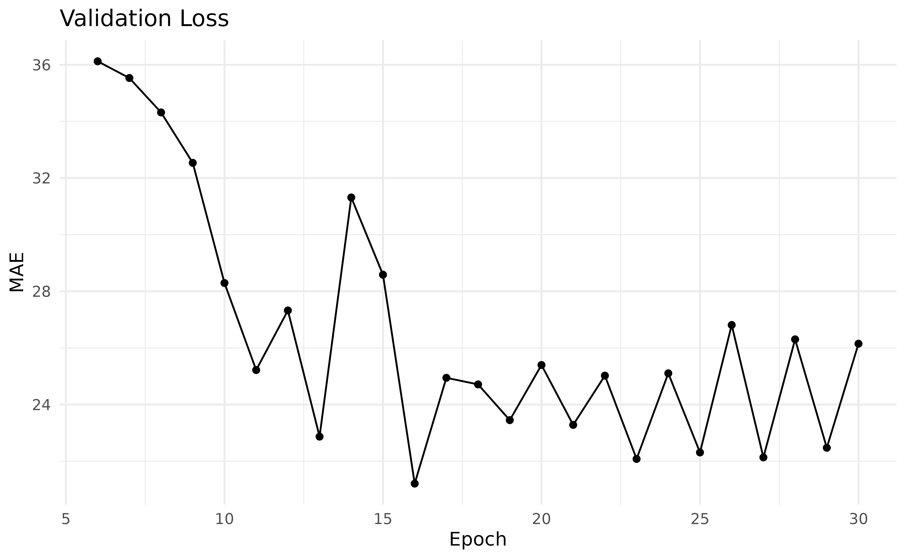

# Get Started

## Quickstart

In this vignette we will show how to get started with `mlr3torch` by
training a simple neural network on a tabular regression problem. We
assume that you are familiar with the `mlr3` framework, see e.g. the
[mlr3 book](https://mlr3book.mlr-org.com/). As a first example, we will
train a simple multi-layer perceptron (MLP) on the well-known “mtcars”
task, where the goal is to predict the miles per galleon (‘mpg’) of
cars. This architecture comes as a predfined learner with `mlr3torch`,
but you can also easily create new network architectures, see the
*Neural Networks as Graphs* vignette for a detailed introduoduion. We
first set a seed for reproducibility, load the library and construct the
task.

``` r
set.seed(314)
library(mlr3torch)
task = tsk("mtcars")
task$head()
#>      mpg    am  carb   cyl  disp  drat  gear    hp  qsec    vs    wt
#>    <num> <num> <num> <num> <num> <num> <num> <num> <num> <num> <num>
#> 1:  21.0     1     4     6   160  3.90     4   110 16.46     0 2.620
#> 2:  21.0     1     4     6   160  3.90     4   110 17.02     0 2.875
#> 3:  22.8     1     1     4   108  3.85     4    93 18.61     1 2.320
#> 4:  21.4     0     1     6   258  3.08     3   110 19.44     1 3.215
#> 5:  18.7     0     2     8   360  3.15     3   175 17.02     0 3.440
#> 6:  18.1     0     1     6   225  2.76     3   105 20.22     1 3.460
```

Learners in `mlr3torch` work very similary to other `mlr3` learners.
Below, we construct a simple multi layer perceptron for regression. We
do this as usual by calling
[`lrn()`](https://mlr3.mlr-org.com/reference/mlr_sugar.html) and
configuring the parameters: We use two hidden layers with 50 neurons,
For training, we set the batch size to 32, the number of training epochs
to 30 and the device to `"cpu"`. For a complete description of the
available parameters see
[`?mlr3torch::LearnerTorchMLP`](https://mlr3torch.mlr-org.com/reference/mlr_learners.mlp.md).

``` r
mlp = lrn("regr.mlp",
  # architecture parameters
  neurons = c(50, 50),
  # training arguments
  batch_size = 32, epochs = 30, device = "cpu"
)
mlp
#> 
#> ── <LearnerTorchMLP> (regr.mlp): Multi Layer Perceptron ────────────────────────
#> • Model: -
#> • Parameters: epochs=30, device=cpu, num_threads=1, num_interop_threads=1,
#> seed=random, eval_freq=1, measures_train=<list>, measures_valid=<list>,
#> patience=0, min_delta=0, batch_size=32, shuffle=TRUE, tensor_dataset=FALSE,
#> jit_trace=FALSE, neurons=50,50, p=0.5, activation=<nn_relu>,
#> activation_args=<list>
#> • Validate: NULL
#> • Packages: mlr3, mlr3torch, and torch
#> • Predict Types: [response]
#> • Feature Types: integer, numeric, and lazy_tensor
#> • Encapsulation: none (fallback: -)
#> • Properties: internal_tuning, marshal, and validation
#> • Other settings: use_weights = 'error'
#> • Optimizer: adam
#> • Loss: mse
#> • Callbacks: -
```

We can use this learner for training and prediction just like any other
regression learner. Below, we split the observations into a training and
test set, train the learner on the training set and create predictions
for the test set. Finally, we compute the mean squared error of the
predictions.

``` r
# Split the obersevations into training and test set
splits = partition(task)
# Train the learner on the train set
mlp$train(task, row_ids = splits$train)
# Predict the test set
prediction = mlp$predict(task, row_ids = splits$test)
# Compute the mse
prediction$score(msr("regr.mse"))
#> regr.mse 
#> 289.5966
```

## Configuring a Learner

Although torch learners are quite like other `mlr3` learners, there are
some differences. One is that all `LearnerTorch` classes have
*construction arguments*, i.e. torch learners are more modular than
other learners. While learners are free to implement their own
construction arguments, there are some that are common to all torch
learners, namely the `loss`, `optimizer` and `callbacks`. Each of these
object can have their own parameters that are included in the
`LearnerTorch`’s parameter set.

In the previous example, we did not specify any of these explicitly and
used the default values, which was the Adam optimizer, MSE as the loss
and no callbacks. We will now show how to configure these three aspects
of a learner through the
[`mlr3torch::TorchOptimizer`](https://mlr3torch.mlr-org.com/reference/TorchOptimizer.md),
[`mlr3torch::TorchLoss`](https://mlr3torch.mlr-org.com/reference/TorchLoss.md),
and
[`mlr3torch::TorchCallback`](https://mlr3torch.mlr-org.com/reference/TorchCallback.md)
classes.

### Loss

The loss function, also known as the objective function or cost
function, measures the discrepancy between the predicted output and the
true output. It quantifies how well the model is performing during
training. The R package `torch`, which underpins the `mlr3torch`
framework, already provides a number of predefined loss functions such
as the Mean Squared Error (`nn_mse_loss`), the Mean Absolute Error
(`nn_l1_loss`), or the cross entropy loss (`nn_cross_entropy_loss`). In
`mlr3torch`, we represent loss functions using the
[`mlr3torch::TorchLoss`](https://mlr3torch.mlr-org.com/reference/TorchLoss.md)
class. It provides a thin wrapper around the torch loss functions and
annotates them with meta information, most importantly a
[`paradox::ParamSet`](https://paradox.mlr-org.com/reference/ParamSet.html)
that allows to configure the loss function. Such an object can be
constructed using `t_loss(<key>)`. Below, we construct the L1 loss
function, which is also known as Mean Absolute Error (MAE). The printed
output below informs us about the wrapped loss function `(nn_l1_loss`),
the configured parameters, the packages it depends on and for which task
types it can be used.

``` r
l1 = t_loss("l1")
l1
#> <TorchLoss:l1> Absolute Error
#> * Generator: nn_l1_loss
#> * Parameters: list()
#> * Packages: torch,mlr3torch
#> * Task Types: regr
```

Its `ParamSet` contains only one parameter, namely `reduction`, which
specifies how the loss is reduced over the batch.

``` r
# the paradox::ParamSet of the loss
l1$param_set
#> <ParamSet(1)>
#>           id    class lower upper nlevels default  value
#>       <char>   <char> <num> <num>   <num>  <list> <list>
#> 1: reduction ParamFct    NA    NA       2    mean [NULL]
```

We can pass the `TorchLoss` as the argument `loss` during initialization
of the learner. The parameters of the loss are added to the learner’s
`ParamSet`, prefixed with `"loss."`.

``` r
mlp_l1 = lrn("regr.mlp", loss = l1)
mlp_l1$param_set$values$loss.reduction
#> NULL
```

All predefined loss functions are stored in the `mlr3torch_losses`
dictionary, from which they can be retrieved using `t_loss(<key>)`.

``` r
mlr3torch_losses
#> <DictionaryMlr3torchLosses> with 3 stored values
#> Keys: cross_entropy, l1, mse
```

### Optimizer

The optimizer determines how the model’s weights are updated based on
the calculated loss. It adjusts the parameters of the model to minimize
the loss function, optimizing the model’s performance. Optimizers work
analogous to loss functions, i.e. `mlr3torch` provides a thin wrapper –
the `TorchOptimizer` class – around the optimizers such as AdamW
(`optim_ignite_adamw`) or SGD (`optim_ignite_sgd`). `TorchLoss` objects
can be constructed using `t_opt(<key>)`. For optimizers, the associated
`ParamSet` is more interesting as we see below:

``` r
sgd = t_opt("sgd")
sgd
#> <TorchOptimizer:sgd> Stochastic Gradient Descent
#> * Generator: optim_ignite_sgd
#> * Parameters: list()
#> * Packages: torch,mlr3torch

sgd$param_set
#> <ParamSet(6)>
#>              id    class lower upper nlevels        default  value
#>          <char>   <char> <num> <num>   <num>         <list> <list>
#> 1:           lr ParamDbl     0   Inf     Inf <NoDefault[0]> [NULL]
#> 2:     momentum ParamDbl     0     1     Inf              0 [NULL]
#> 3:    dampening ParamDbl     0     1     Inf              0 [NULL]
#> 4: weight_decay ParamDbl     0     1     Inf              0 [NULL]
#> 5:     nesterov ParamLgl    NA    NA       2          FALSE [NULL]
#> 6: param_groups ParamUty    NA    NA     Inf <NoDefault[0]> [NULL]
```

Parameters of `TorchOptimizer` (but also `TorchLoss` and
`TorchCallback`) can be set in the usual `mlr3` way, i.e. either during
construction, or afterwards using the `$set_values()` method of the
parameter set.

``` r
sgd$param_set$set_values(
  lr = 0.5, # increase learning rate
  nesterov = FALSE # no nesterov momentum
)
```

Below we see that the optimizer’s parameters are added to the learner’s
`ParamSet` (prefixed with `"opt."`) and that the values are set to the
values we specified.

``` r
mlp_sgd = lrn("regr.mlp", optimizer = sgd)
as.data.table(mlp_sgd$param_set)[
  startsWith(id, "opt.")][[1L]]
#> [1] "opt.lr"           "opt.momentum"     "opt.dampening"    "opt.weight_decay"
#> [5] "opt.nesterov"     "opt.param_groups"
mlp_sgd$param_set$values[c("opt.lr", "opt.nesterov")]
#> $opt.lr
#> [1] 0.5
#> 
#> $opt.nesterov
#> [1] FALSE
```

By exposing the optimizer’s parameters, they can be conveniently tuned
using [`mlr3tuning`](https://github.com/mlr-org/mlr3tuning).

All available optimizers are stored in the `mlr3torch_optimizers`
dictionary.

``` r
mlr3torch_optimizers
#> <DictionaryMlr3torchOptimizers> with 5 stored values
#> Keys: adagrad, adam, adamw, rmsprop, sgd
```

### Callbacks

The third important configuration option are callbacks which allow to
customize the training process. This allows saving model checkpoints,
logging metrics, or implementing custom functionality for specific
training scenarios. For a tutorial on how to implement a custom
callback, see the *Custom Callbacks* vignette. Here, we will only show
how to use predefined callbacks. Below, we retrieve the `"history"`
callback using
[`t_clbk()`](https://mlr3torch.mlr-org.com/reference/t_clbk.md), which
has no parameters and merely saves the training and validation history
in the learner so it can be accessed afterwards.

``` r
history = t_clbk("history")
history
#> <TorchCallback:history> History
#> * Generator: CallbackSetHistory
#> * Parameters: list()
#> * Packages: mlr3torch,torch
```

If we wanted to learn about what the callback does, we can access the
help page of the wrapped object using the `$help()` method. Note that
this is also possible for the loss and optimizer.

``` r
history$help()
```

All predefined callbacks are stored in the `mlr3torch_callbacks`
dictionary.

``` r
mlr3torch_callbacks
#> <DictionaryMlr3torchCallbacks> with 11 stored values
#> Keys: checkpoint, history, lr_cosine_annealing, lr_lambda,
#>   lr_multiplicative, lr_one_cycle, lr_reduce_on_plateau, lr_step,
#>   progress, tb, unfreeze
```

### Putting it Together

We now define our customized MLP learner using the loss, optimizer and
callback we have just covered. To keep track of the performance, we use
30% of the training data for validation and evaluate it using the MAE
`Measure`. Note that the `mearures_valid` and `measures_train`
parameters of `LearnerTorch` take common
[`mlr3::Measure`](https://mlr3.mlr-org.com/reference/Measure.html)s,
whereas the loss function must be a `TorchLoss`.

``` r
mlp_custom = lrn("regr.mlp",
  # construction arguments
  optimizer = sgd, loss = l1, callbacks = history,
  # scores to keep track of
  measures_valid = msr("regr.mae"),
  # other parameters are left as-is:
  # architecture
  neurons = c(50, 50),
  # training arguments
  batch_size = 32, epochs = 30, device = "cpu",
  # validation proportion
  validate = 0.3
)

mlp_custom
#> 
#> ── <LearnerTorchMLP> (regr.mlp): Multi Layer Perceptron ────────────────────────
#> • Model: -
#> • Parameters: epochs=30, device=cpu, num_threads=1, num_interop_threads=1,
#> seed=random, eval_freq=1, measures_train=<list>,
#> measures_valid=<MeasureRegrSimple>, patience=0, min_delta=0, batch_size=32,
#> shuffle=TRUE, tensor_dataset=FALSE, jit_trace=FALSE, neurons=50,50, p=0.5,
#> activation=<nn_relu>, activation_args=<list>, opt.lr=0.5, opt.nesterov=FALSE
#> • Validate: 0.3
#> • Packages: mlr3, mlr3torch, and torch
#> • Predict Types: [response]
#> • Feature Types: integer, numeric, and lazy_tensor
#> • Encapsulation: none (fallback: -)
#> • Properties: internal_tuning, marshal, and validation
#> • Other settings: use_weights = 'error'
#> • Optimizer: sgd
#> • Loss: l1
#> • Callbacks: history
```

We now train the learner on the “mtcars” task again and use the same
train-test split as before.

``` r
mlp_custom$train(task, row_ids = splits$train)
prediction_custom = mlp_custom$predict(task, row_ids = splits$test)
```

Below we make predictions on the unseen test data and compare the
scores. Because we directly optimized the L1 (aka MAE) loss and tweaked
the learning rate, our configured `mlp_custom` learner has a lower MAE
than the default `mlp` learner.

``` r
prediction_custom$score(msr("regr.mae"))
#> regr.mae 
#> 13.14184
prediction$score(msr("regr.mae"))
#> regr.mae 
#> 15.44357
```

Because we configured the learner to use the history callback, we can
find the validation history in its `$model` slot:

``` r
head(mlp_custom$model$callbacks$history)
#>    epoch valid.regr.mae
#>    <num>          <num>
#> 1:     1   1.952632e+04
#> 2:     2   1.480273e+10
#> 3:     3   1.907161e+09
#> 4:     4   6.248891e+04
#> 5:     5   8.702156e+01
#> 6:     6   3.612308e+01
```

The plot below shows it for the epochs 6 to 30.



Other important information that is stored in the `Learner`’s model is
the `$network`, which is the underlying `nn_module`. For a full
description of the model, see
[`?LearnerTorch`](https://mlr3torch.mlr-org.com/reference/mlr_learners_torch.md).
