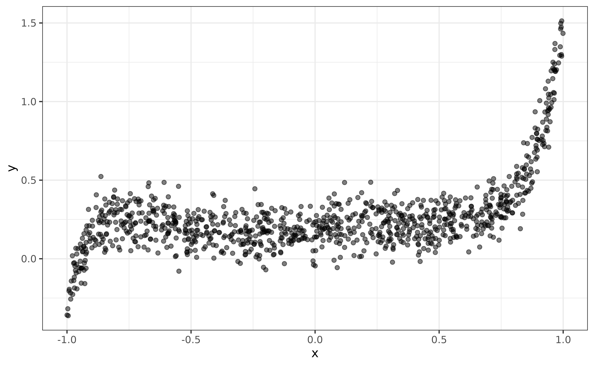
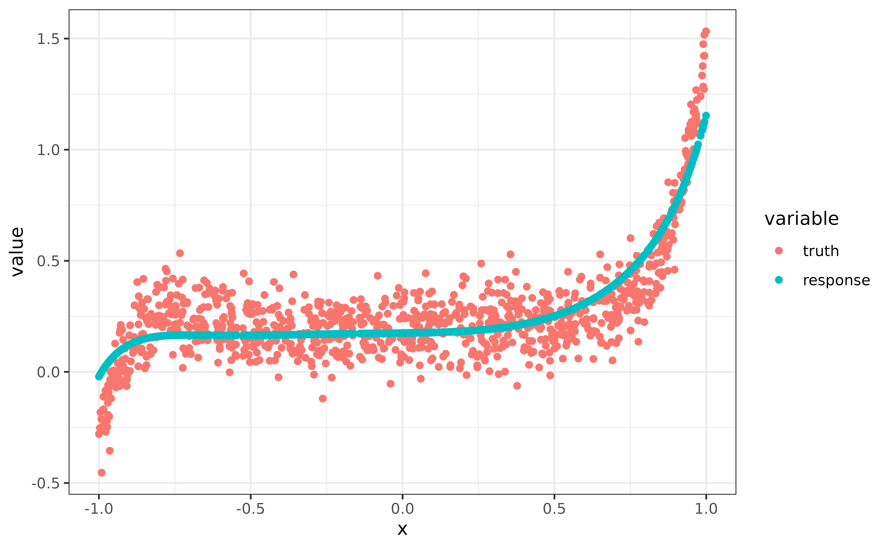

# Lazy Tensor

This vignette introduces the `lazy_tensor` class, which is a vector type
that can be used to lazily represent torch tensors of arbitary
dimensions. Among other things, it allows `mlr3torch` to work with
images, which we will illustrate using the predefined MNIST task, which
has one feature `image` of class `"lazy_tensor"`. The images display the
digits 0, …, 9, and the goal is to classify them correctly.

``` r
library(mlr3torch)

mnist = tsk("mnist")
mnist
#> 
#> ── <TaskClassif> (70000x2): MNIST Digit Classification ─────────────────────────
#> • Target: label
#> • Target classes: 1 (11%), 7 (10%), 3 (10%), 2 (10%), 9 (10%), 0 (10%), 6
#> (10%), 8 (10%), 4 (10%), 5 (9%)
#> • Properties: multiclass
#> • Features (1):
#>   • lt (1): image
```

The name `"lazy_tensor"` stems from the fact, that the tensors are not
necessarily stored in memory, as this is often impossible when working
with large image datasets.  
Therefore, we can easily access the data without any expensive
data-loading. We see that the data contains one column *label*, which is
the target variable, and an `image` which is the input feature.

``` r
mnist$head()
#>     label           image
#>    <fctr>   <lazy_tensor>
#> 1:      5 <tnsr[1x28x28]>
#> 2:      0 <tnsr[1x28x28]>
#> 3:      4 <tnsr[1x28x28]>
#> 4:      1 <tnsr[1x28x28]>
#> 5:      9 <tnsr[1x28x28]>
#> 6:      2 <tnsr[1x28x28]>
```

If we wanted to obtain the actual tensors representing the images, we
can do so by calling
[`materialize()`](https://mlr3torch.mlr-org.com/reference/materialize.md),
which will return a list of `torch_tensor`s, not necessarily all with
the same shape. Here, we only show a slice of the tensor for
readability.

``` r
lt = mnist$data(cols = "image")[[1L]]
materialize(lt[1])[[1]][1, 12:16, 12:16]
#> torch_tensor
#>  139  253  190    2    0
#>   11  190  253   70    0
#>    0   35  241  225  160
#>    0    0   81  240  253
#>    0    0    0   45  186
#> [ CPUFloatType{5,5} ]
```

If all elements have the same shape as is the case here, we could also
obtain a single `torch_tensor` by specifying `rbind = TRUE`.

In order to train a `Learner` on a `Task` containing `lazy_tensor`
columns it must support the `lazy_tensor` feature type, as is the case
for the multi layer perceptron, which works both with `numeric` types,
as well as the `lazy_tensor`.

``` r
mlp = lrn("classif.mlp",
  neurons = c(100, 100),
  epochs = 10, batch_size = 32
)
mlp
#> 
#> ── <LearnerTorchMLP> (classif.mlp): Multi Layer Perceptron ─────────────────────
#> • Model: -
#> • Parameters: epochs=10, device=auto, num_threads=1, num_interop_threads=1,
#> seed=random, eval_freq=1, measures_train=<list>, measures_valid=<list>,
#> patience=0, min_delta=0, batch_size=32, shuffle=TRUE, tensor_dataset=FALSE,
#> jit_trace=FALSE, neurons=100,100, p=0.5, activation=<nn_relu>,
#> activation_args=<list>
#> • Validate: NULL
#> • Packages: mlr3, mlr3torch, and torch
#> • Predict Types: [response] and prob
#> • Feature Types: integer, numeric, and lazy_tensor
#> • Encapsulation: none (fallback: -)
#> • Properties: internal_tuning, marshal, multiclass, twoclass, and validation
#> • Other settings: use_weights = 'error'
#> • Optimizer: adam
#> • Loss: cross_entropy
#> • Callbacks: -
```

However, because `lazy_tensor`s also have a specific shape, we also must
ensure that the shape of the `lazy_tensor` matches the expected input
shape of the learner. The multi layer perceptron expects a 2d-tensor
where the first dimension is the batch dimension. But above we have seen
that this is not the case for MNIST, where each element has shape
`(1, 28, 28)`. Therefore, we need to flatten the `lazy_tensor`, which we
here do using `po("trafo_reshape")`:

``` r
reshaper = po("trafo_reshape", shape = c(-1, 28 * 28))
mnist_flat = reshaper$train(list(mnist))[[1L]]
mnist_flat$head()
#>     label         image
#>    <fctr> <lazy_tensor>
#> 1:      5   <tnsr[784]>
#> 2:      0   <tnsr[784]>
#> 3:      4   <tnsr[784]>
#> 4:      1   <tnsr[784]>
#> 5:      9   <tnsr[784]>
#> 6:      2   <tnsr[784]>
```

Note that this does not *actually* reshape all the tensors in-memory,
this will again only happen once
[`materialize()`](https://mlr3torch.mlr-org.com/reference/materialize.md)
is called.

We can now proceed to train the a simple multi-layer perceptron on the
flattened mnist task:

``` r
mlp = lrn("classif.mlp",
  neurons = c(100, 100),
  epochs = 10, batch_size = 32
)
mlp$train(mnist_flat)
```

## Creating a Lazy Tensor

Every `lazy_tensor` is built on top of a
[`torch::dataset`](https://torch.mlverse.org/docs/reference/dataset.html),
so we here assume that you are familiar with it. For more information on
how to create
[`torch::dataset`](https://torch.mlverse.org/docs/reference/dataset.html)s,
we recommend reading the [torch package
documentation](https://torch.mlverse.org/). The only additional
restriction that we impose on the dataset is that it must have a
`.getitem` or `.getbatch` method that returns a list of named tensors.

As an example, we will create a `lazy_tensor` of length 1000, whose
elements are drawn from a uniform distribution over \\\[0, 1\]\\. While
the data is stored in-memory in this example, this is not necessary and
the `$.getitem()` method can e.g. load images from disk.

``` r
mydata = dataset(
  initialize = function() {
    self$x = runif(1000, -1, 1)
  },
  .getbatch = function(i) list(x = torch_tensor(self$x[i])$unsqueeze(2)),
  .length = function() 1000
)()
```

In order to create a `lazy_tensor` from `mydata`, we have to annotate
the returned shapes of the dataset by passing a named list to
`dataset_shapes`. The first dimension must be `NA`, as it is the batch
dimension. We can also set a shape to `NULL` to indicate that it is
unknown, i.e. it varies between elements.

``` r
lt = as_lazy_tensor(mydata, dataset_shapes = list(x = c(NA, 1)))
lt[1:5]
#> <ltnsr[5]>
#> [1] <tnsr[1]> <tnsr[1]> <tnsr[1]> <tnsr[1]> <tnsr[1]>
```

Note that in this case, because we implemented the `.getbatch` method,
we could have even omitted specifying the `dataset_shapes` as they could
have been auto-inferred.

We can convert this vector to a `torch_tensor` just like before:

``` r
materialize(lt[1:5], rbind = TRUE)
#> torch_tensor
#> -0.9852
#> -0.0672
#> -0.0044
#> -0.4205
#>  0.4658
#> [ CPUFloatType{5,1} ]
```

Because we added no preprocessing, this is the same as calling the
`$.getbatch()` method on `mydata` and selecting the element `x`.

``` r
torch_equal(
  materialize(lt[1], rbind = TRUE),
  mydata$.getbatch(1)$x
)
#> [1] TRUE
```

We continue with creating an example task from `lt`, where the
relationship between the `x` and `y` variable is polynomial. Note that
the target variable, both for classification and regression, cannot be a
`lazy_tensor`, but must be a `factor` or `numeric` respectively.

``` r
library(data.table)
x = mydata$x
y = 0.2 + 0.1 * x - 0.1 * x^2 - 0.3 * x^3 + 0.5 * x^4 + 0.5 * x^7 + 0.6 * x^11 + rnorm(length(mydata)) * 0.1
dt = data.table(y = y, x = lt)
task_poly = as_task_regr(dt, target = "y", id = "poly")
task_poly
#> 
#> ── <TaskRegr> (1000x2) ─────────────────────────────────────────────────────────
#> • Target: y
#> • Properties: -
#> • Features (1):
#>   • lt (1): x
```

Below, we plot the data:

``` r
library(ggplot2)
ggplot(data = data.frame(x = x, y = y)) +
  geom_point(aes(x = x, y = y), alpha = 0.5)
```



In the next section, we will create a custom `PipeOp` to fit a
polynomial regression model.

## Custom Preprocessing

In order to create a custom preprocessing operator for a lazy tensor, we
have to create a new `PipeOp` class. To make this as convenient as
possible, `mlr3torch` offters a
[`pipeop_preproc_torch()`](https://mlr3torch.mlr-org.com/reference/pipeop_preproc_torch.md)
function that we recommend using for this purpose. Its most important
arguments are:

- `id` - Used as the default identifier of the `PipeOp`
- `fn` - The preprocessing function. By default, the first argument is
  assumed to be the `torch_tensor` and the remaining arguments will be
  part of the `PipeOp`’s parameter set.
- `shapes_out` - A function that returns the shapes of the output
  tensors given the input shapes. This can also be set to `NULL` for an
  unknown shape or to `"infer"` for auto-inference, see
  [`?pipeop_preproc_torch`](https://mlr3torch.mlr-org.com/reference/pipeop_preproc_torch.md)
  for more information.

Below, we create a `PipeOp`, that transforms a vector `x` into a matrix
\\(x^{d_1} ..., x^{d_n})\\, where \\d\\ is the `degrees` parameter of
the `PipeOp`.

``` r
PipeOpPreprocTorchPoly = pipeop_preproc_torch("poly",
  fn = function(x, degrees) {
    torch_cat(lapply(degrees, function(d) torch_pow(x, d)), dim = 2L)
  },
  shapes_out = "infer"
)
```

We can now create a new instance of this `PipeOp` by calling `$new()`,
and we set the parameter `degrees` to those degrees that were used when
simulating the data above. Further, we set the parameter `stages`, that
is always available, to `"both"`, which means that the preprocessing is
applied during training and prediction. For data augmentation this can
be set to `"train"`.

``` r
po_poly = PipeOpPreprocTorchPoly$new()

po_poly$param_set$set_values(
  degrees = c(0, 1, 2, 3, 4, 7, 11),
  stages = "both"
)
```

To create our polynomial regression learner, we combine the polynomial
preprocessor with a `lrn("regr.mlp")` with no hidden layer (i.e. a
linear model) and train the learner on the task.

``` r
lrn_poly = as_learner(
  po_poly %>>% lrn("regr.mlp", batch_size = 256, epochs = 100,
  neurons = integer(0))
)

lrn_poly$train(task_poly)
pred = lrn_poly$predict(task_poly)
```

Below, we visualize the predictions and see that the model captured the
non-linear relationship reasonably:

``` r
dt = melt(data.table(
  truth = pred$truth,
  response = pred$response,
  x = x),
  id.vars = "x", measure.vars = c("truth", "response")
)
dt$variable = factor(dt$variable, levels = c("truth", "response"))

ggplot(data = dt) +
  geom_point(aes(x = x, y = value, color = variable))
```



In the next section, we will briefly cover the implementation details of
the `lazy_tensor`, which is not necessary to work with the data-type, so
feel free to skip this part.

## Digging Into Internals

Internally, the `lazy_tensor` vector uses the `DataDescriptor` class to
represent the (possibly) preprocessed data. It is very similar to the
`ModelDescriptor` class that is used to build up neural nerworks using
`PipeOpTorch` objects. The `DataDescriptor` stores a
[`torch::dataset`](https://torch.mlverse.org/docs/reference/dataset.html),
an
[`mlr3pipelines::Graph`](https://mlr3pipelines.mlr-org.com/reference/Graph.html)
and some metadata.

``` r
desc = DataDescriptor$new(
  dataset = mydata,
  dataset_shapes = list(x = c(NA, 1))
)
```

Per default, the preprocessing graph contains only a single `PipOpNop`
that does nothing.

``` r
desc
#> <DataDescriptor: 1 ops>
#> * dataset_shapes: [x: (NA,1)]
#> * input_map: (x) -> Graph
#> * pointer: nop.44c491.x.output
#> * shape: [(NA,1)]
```

The printed output of the data descriptor informs us about:

- The number of `PipeOp`s contained in the preprocessing graph
- The output shapes of the dataset
- The input map, i.e. how the data is passed to the preprocessing graph,
  which is important when there are multiple inputs
- The `pointer`, which points to a specific channel of an output
  `PipeOp`. The output of this channel is the tensor represented by the
  `DataDescriptor`. Note that the `id` from the input `po("nop")` is
  randomly generated, which is needed to prevent id clashes then there
  are more than one input to the preprocessing graph.
- The `shape`, which is the shape of the tensor at position `pointer`

A lazy tensor can be constructed from an integer vector and a
`DataDescriptor`. The integer vector specifies which element of the
`DataDescriptor` the `lazy_tensor` contains. Below, the first two
elements of the `lazy_tensor` vector represent the same element of the
`DataDescriptor`, while the third element represents a different
element. Note that all indices refer to the same `DataDescriptor`.

``` r
lt = lazy_tensor(desc, ids = c(1, 1, 2))
materialize(lt, rbind = TRUE)
#> torch_tensor
#> -0.9852
#> -0.9852
#> -0.0672
#> [ CPUFloatType{3,1} ]
```

Internally, the lazy tensor is represented as a list of lists, each
element containing an id and a `DataDescriptor` Currently, there can
only be a single `DataDescriptor` in a `lazy_tensor` vector.

``` r
unclass(lt[[1]])
#> [[1]]
#> [1] 1
#> 
#> [[2]]
#> <DataDescriptor: 1 ops>
#> * dataset_shapes: [x: (NA,1)]
#> * input_map: (x) -> Graph
#> * pointer: nop.44c491.x.output
#> * shape: [(NA,1)]
```

What happens during `materialize(lt[1])` is the following:

``` r
# get index and data descriptor
desc = lt[[1]][[2]]
id = lt[[1]][[1]]

# retrieve the batch <id> from the datast
dataset_output = desc$dataset$.getbatch(id)

# batch is reorganized according to the input map
graph_input = dataset_output[desc$input_map]
names(graph_input) = names(desc$graph$input$name)

# the reorganized batch is fed into the preprocessing graph
graph_output = desc$graph$train(graph_input, single_input = FALSE)

# the output pointed to by the pointer is returned
tensor = graph_output[[paste0(desc$pointer, collapse = ".")]]
tensor
#> torch_tensor
#> -0.9852
#> [ CPUFloatType{1,1} ]
```

Preprocessing a `lazy_tensor` vector adds new `PipeOp`s to the
preprocessing graph and updates the metainformation like the pointer and
output shape. To show this, we create a simple example task, using the
`lt` vector as a feature.

``` r
taskin = as_task_regr(data.table(x = lt, y = 1:3), target = "y")

taskout = po_poly$train(list(taskin))[[1L]]

lt_out = taskout$data(cols = "x")$x

descout = lt_out[[1]][[2]]

descout
#> <DataDescriptor: 2 ops>
#> * dataset_shapes: [x: (NA,1)]
#> * input_map: (x) -> Graph
#> * pointer: poly.x.output
#> * shape: [(NA,7)]

descout$graph
#> 
#> ── Graph with 2 PipeOps: ───────────────────────────────────────────────────────
#>            ID         State sccssors    prdcssors
#>        <char>        <char>   <char>       <char>
#>  nop.44c491.x        <list>   poly.x             
#>        poly.x <<UNTRAINED>>          nop.44c491.x
#> 
#> ── Pipeline: <INPUT> -> nop.44c491.x -> poly.x -> <OUTPUT>
```

We see that the `$graph` has a new pipeop with id `"poly.x"` and the
output `pointer` points to `poly.x`. Also we see that the shape of the
tensor is now `c(NA, 7)` and not `c(NA, 1)` as before, which we can
verify by calling
[`materialize()`](https://mlr3torch.mlr-org.com/reference/materialize.md)
again:

``` r
materialize(lt_out[1:2], rbind = TRUE)
#> torch_tensor
#>  1.0000 -0.9852  0.9706 -0.9563  0.9421 -0.9009 -0.8487
#>  1.0000 -0.9852  0.9706 -0.9563  0.9421 -0.9009 -0.8487
#> [ CPUFloatType{2,7} ]
```
