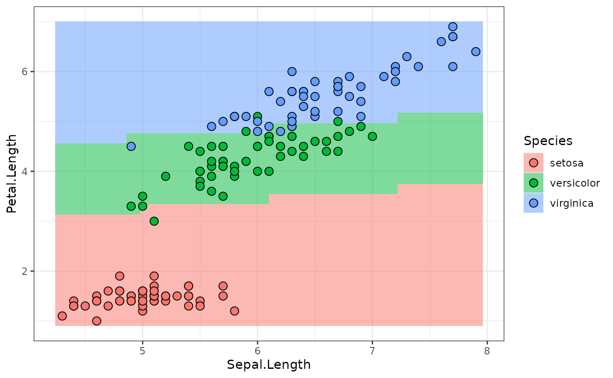

# Internals

This vignette contains technical details about the inner workings of
representing neural networks as
[`mlr3pipelines::Graph`](https://mlr3pipelines.mlr-org.com/reference/Graph.html)s.
If you are not familiar with `mlr3pipelines`, start by reading the
[related sections from the mlr3
book](https://mlr3book.mlr-org.com/chapters/chapter7/sequential_pipelines.html)
first.

## A `torch` Primer

We start by sampling some input tensor: 2 batches with 3 features:

``` r
input = torch_randn(2, 3)
input
#> torch_tensor
#> -0.4738  0.0381 -0.3160
#>  0.4052 -0.4391 -0.9378
#> [ CPUFloatType{2,3} ]
```

A `nn_module` is constructed from a `nn_module_generator`. `nn_linear`
is one of the simpler generators:

``` r
module_1 = nn_linear(in_features = 3, out_features = 4, bias = TRUE)
```

Applying this module gives a 2-batch of 4 units:

``` r
output = module_1(input)
output
#> torch_tensor
#> -0.5984 -0.3886  0.4692  0.7319
#> -0.2340 -0.2356  0.3458  0.3822
#> [ CPUFloatType{2,4} ][ grad_fn = <AddmmBackward0> ]
```

A neural network with one (4-unit) hidden layer and two outputs needs
the following ingredients

``` r
activation = nn_sigmoid()
module_2 = nn_linear(4, 3, bias = TRUE)
softmax = nn_softmax(2)
```

We can pipe a tensor through the layers as follows.

``` r
output = module_1(input)
output = activation(output)
output = module_2(output)
output = softmax(output)
output
#> torch_tensor
#>  0.1634  0.3735  0.4631
#>  0.1600  0.3771  0.4629
#> [ CPUFloatType{2,3} ][ grad_fn = <SoftmaxBackward0> ]
```

We will now continue with showing how such a neural network can be
represented in `mlr3torch`.

## Neural Networks as Graphs

In `mlr3torch`, `nn_module`s are wrapped in a `PipeOpModule`. This has
the advantage that the network structure can be represented as an
[`mlr3pipelines::Graph`](https://mlr3pipelines.mlr-org.com/reference/Graph.html)
object where it is made explicit (can be plotted, can be extended or
manipulated), compared to e.g. writing a function that pipes input
through a series of modules.

A `PipeOpModule` can be used to wrap a module directly, but it is
usually constructed by a `PipeOpTorch` (see later). It typically has a
single input and a single output, although multiple inputs are possible
(module is then called with multiple arguments), and multiple outputs
are possible when the module-function returns a list. The input and
output channels must be explicitly declared then during construction. We
will now continue to recreate the above network using `PipeOpModule`s.

We can wrap the linear `module_1` layers like this:

``` r
library(mlr3torch)
po_module_1 = po("module_1", module = module_1)
```

Note that `po("module_1")` is equivalent to
`po("module", id = "module_1")`. This mechanism is convenient to avoid
ID clashes in graphs that contain the same `PipeOp` multiple times.

We can use the generated `PipeOp` in the familiar way:

``` r
output = po_module_1$train(list(input))[[1]]
output
#> torch_tensor
#> -0.5984 -0.3886  0.4692  0.7319
#> -0.2340 -0.2356  0.3458  0.3822
#> [ CPUFloatType{2,4} ][ grad_fn = <AddmmBackward0> ]
```

Note we only use the `$train()`, since torch modules do not have
anything that maps to the `state` (it is filled by an empty list).

The single hidden layer neural network can be constructed as a `Graph`,
which can then do the training all at once.

``` r
po_activation = po("module", id = "activation", activation)
po_module_2 = po("module_2", module = module_2)
po_softmax = po("module", id = "softmax", module = softmax)

module_graph = po_module_1 %>>%
  po_activation %>>%
  po_module_2 %>>%
  po_softmax

module_graph$plot(html = TRUE)
```

We can now use the graph’s `$train()` method to pipe a tensor through
the whole `Graph`.

``` r
output = module_graph$train(input)[[1]]
output
#> torch_tensor
#>  0.1634  0.3735  0.4631
#>  0.1600  0.3771  0.4629
#> [ CPUFloatType{2,3} ][ grad_fn = <SoftmaxBackward0> ]
```

While this object allows to easily perform a forward pass, it does not
inherit from `nn_module`, which is useful for various reasons. Instead
of having a class that inherits both from `nn_module` and `Graph` (which
does not work in R6, since multiple inheritance is not available), there
is a class that inherits from `nn_module` and contains a `Graph` member
slot through composition. This class is `nn_graph`. It is constructed
with a `Graph`, as well as information about the shape(s) of the
`torch_tensor`(s) it expects as inputs.

Shape info is communicated as an integer-valued `numeric` vector;
dimensions that are arbitrary, e.g. batch-size, is given as `NA`. Our
network expects an input of shape `c(NA, 3)`, since the first layer was
created as `nn_linear(in_features = 3, ...)`.

If the `Graph` has multiple outputs, it is also possible to select a
subset of outputs to use, or change the output order, by giving the
`output_map` argument.

``` r
# the name of the single input is:
module_graph$input
#>              name        train predict    op.id channel.name
#>            <char>       <char>  <char>   <char>       <char>
#> 1: module_1.input torch_tensor    NULL module_1        input

graph_module = nn_graph(
  module_graph,
  shapes_in = list(module_1.input = c(NA, 3))
)
```

This module gives us the convenience of torch `nn_module` objects, e.g.:

``` r
graph_module$children
#> $module_list
#> An `nn_module` containing 31 parameters.
#> 
#> ── Modules ─────────────────────────────────────────────────────────────────────
#> • 0: <nn_linear> #16 parameters
#> • 1: <nn_sigmoid> #0 parameters
#> • 2: <nn_linear> #15 parameters
#> • 3: <nn_softmax> #0 parameters
```

And it can be used to transform tensors just as any other
[`torch::nn_module`](https://torch.mlverse.org/docs/reference/nn_module.html):

``` r
graph_module(input)
#> torch_tensor
#>  0.1634  0.3735  0.4631
#>  0.1600  0.3771  0.4629
#> [ CPUFloatType{2,3} ][ grad_fn = <SoftmaxBackward0> ]
```

## Building Torch Models for Tasks using `PipeOpTorch`

### `ModelDescriptor`

The `PipeOpModule` represents an `nn_module` that is fixed for a
specific tensor shape and which has no hyperparameters. When
constructing a neural network using these operators, one has to take
care to have the output shape of operations match the input shapes of
the following operations.

A complete `Graph` of matching `PipeOpModule`s can be constructed using
operators that mostly inherit from `PipeOpTorch`, making use of the
`ModelDescriptor` class. The `ModelDescriptor` class contains a `Graph`
of (mostly) `PipeOpModule`s and some other information. The
`PipeOpTorch` transforms a `ModelDescriptor` and adds more
`PipeOpModule`s to the `Graph`.

`ModelDescriptor`s always build up a `Graph` for a specific `Task`. The
easiest way to initialize a proper `ModelDescriptor` is to use the
appropriate `PipeOpTorchIngress` for a given datatype. Below we use
`PipeOpTorchIngressNumeric`, which is is is used for numeric data.

``` r
task = tsk("iris")$select(colnames(iris)[1:3])

po_torch_in = po("torch_ingress_num")
md = po_torch_in$train(list(task))[[1]]

md
#> <ModelDescriptor: 1 ops>
#> * Ingress:  torch_ingress_num.input: [(NA,3)]
#> * Task:  iris [classif]
#> * Callbacks:  N/A
#> * Optimizer:  N/A
#> * Loss:  N/A
#> * pointer:  torch_ingress_num.output [(NA,3)]
```

The `ModelDescriptor` is an S3 object that contains a `Graph`,
information about how to generate data (`$ingress` and `$task`), some
further tags about how to build a model that are unrelated to
architecture (`$optimizer`, `$loss` and `$callbacks`) as well as all
further information necessary to extend that graph along a given output
(`$pointer` and `$pointer_shape`).

``` r
unclass(md)
#> $graph
#> 
#> ── Graph with 1 PipeOps: ───────────────────────────────────────────────────────
#>                 ID         State sccssors prdcssors
#>             <char>        <char>   <char>    <char>
#>  torch_ingress_num <<UNTRAINED>>                   
#> 
#> ── Pipeline: <INPUT> -> torch_ingress_num -> <OUTPUT> 
#> 
#> $ingress
#> $ingress$torch_ingress_num.input
#> Ingress: Task[selector_name(c("Petal.Length", "Sepal.Length", "Sepal.Width"), assert_present = TRUE)] --> Tensor(NA, 3)
#> 
#> 
#> $task
#> 
#> ── <TaskClassif> (150x4): Iris Flowers ─────────────────────────────────────────
#> • Target: Species
#> • Target classes: setosa (33%), versicolor (33%), virginica (33%)
#> • Properties: multiclass
#> • Features (3):
#>   • dbl (3): Petal.Length, Sepal.Length, Sepal.Width
#> 
#> $optimizer
#> NULL
#> 
#> $loss
#> NULL
#> 
#> $callbacks
#> named list()
#> 
#> $pointer
#> [1] "torch_ingress_num" "output"           
#> 
#> $pointer_shape
#> [1] NA  3
```

The `$pointer` identifies the output of the `$graph` that `PipeOpTorch`
will extend. Piping this `ModelDescriptor` through `PipeOpTorchLinear`,
for example, adds a `PipeOpModule` wrapping a
[`torch::nn_linear`](https://torch.mlverse.org/docs/reference/nn_linear.html).

``` r
po_torch_linear = po("nn_linear", out_features = 4)
md = po_torch_linear$train(list(md))[[1]]

md$graph
#> 
#> ── Graph with 2 PipeOps: ───────────────────────────────────────────────────────
#>                 ID         State  sccssors         prdcssors
#>             <char>        <char>    <char>            <char>
#>  torch_ingress_num <<UNTRAINED>> nn_linear                  
#>          nn_linear <<UNTRAINED>>           torch_ingress_num
#> 
#> ── Pipeline: <INPUT> -> torch_ingress_num -> nn_linear -> <OUTPUT>
```

The `$pointer` is now updated to identify the output of that
`PipeOpModule`, and the `$pointer_shape` shows that the shape has
changed to 4 units (was 3 for the input before).

``` r
md$pointer
#> [1] "nn_linear" "output"
md$pointer_shape
#> [1] NA  4
```

The
[`model_descriptor_to_module()`](https://mlr3torch.mlr-org.com/dev/reference/model_descriptor_to_module.md)
function converts this to an `nn_graph`, it is a functional
[`torch::nn_module`](https://torch.mlverse.org/docs/reference/nn_module.html).

``` r
small_module = model_descriptor_to_module(md, list(md$pointer))

small_module(input)
#> torch_tensor
#>  0.2325  0.1188  0.4850  0.4211
#>  0.3217 -0.0948 -0.0778 -0.0073
#> [ CPUFloatType{2,4} ][ grad_fn = <AddmmBackward0> ]
```

### Using `ModelDescriptor` to get Data

The `ModelDescriptor` does not only represent the `Graph` from which a
`nn_module` is created, but also the way in which the `Task` is is
processed to get input batches. A
[`torch::dataset`](https://torch.mlverse.org/docs/reference/dataset.html)
can be created by calling
[`task_dataset()`](https://mlr3torch.mlr-org.com/dev/reference/task_dataset.md);
both the `task` and the `feature_ingress_tokens` arguments can be
retrieved from the `ModelDescriptor`. The `target_batchgetter` needs to
be created extra (if necessary), since it depends on the ultimate
machine learning model, which we have not looked at so far.

``` r
td = task_dataset(
  task = md$task,
  feature_ingress_tokens = md$ingress
)

td
#> <task_dataset>
#>   Inherits from: <dataset>
#>   Public:
#>     .getbatch: function (index) 
#>     .getitem: function (index) 
#>     .length: function () 
#>     all_features: Petal.Length Sepal.Length Sepal.Width Species
#>     cache_lazy_tensors: FALSE
#>     clone: function (deep = FALSE) 
#>     feature_ingress_tokens: list
#>     initialize: function (task, feature_ingress_tokens, target_batchgetter = NULL) 
#>     load_state_dict: function (x, ..., .refer_to_state_dict = FALSE) 
#>     state_dict: function () 
#>     target_batchgetter: NULL
#>     task: TaskClassif, TaskSupervised, Task, R6
```

Use the `$.getbatch()` method to get a batch that can be given to the
`nn_module`. Note it has an `$x` and an `$y` slot, the latter of which
is not used, to account for possible target batches. The `$x` slot is
also a `list`, since it should be able to handle NNs with multiple
inputs (see below).

``` r
batch = td$.getbatch(1:3)
batch
#> $x
#> $x$torch_ingress_num.input
#> torch_tensor
#>  1.4000  5.1000  3.5000
#>  1.4000  4.9000  3.0000
#>  1.3000  4.7000  3.2000
#> [ CPUFloatType{3,3} ]
#> 
#> 
#> $.index
#> torch_tensor
#>  1
#>  2
#>  3
#> [ CPULongType{3} ]

small_module(batch$x[[1]])
#> torch_tensor
#> -2.6566 -2.1098  1.4212  2.6512
#> -2.4150 -2.0333  1.3308  2.4474
#> -2.4424 -1.9537  1.3265  2.4692
#> [ CPUFloatType{3,4} ][ grad_fn = <AddmmBackward0> ]
```

### Building sequential NNs

The sequential NN from above can easily be implemented as follows:

``` r
graph_generator = po("torch_ingress_num") %>>%
  po("nn_linear", out_features = 4, id = "linear1") %>>%
    po("nn_sigmoid") %>>%
  po("nn_linear", out_features = 3, id = "linear2") %>>%
  po("nn_softmax", dim = 2)
```

Note how the second `nn_linear` does not need to be informed about the
output dimension of the first `nn_linear`, since the `ModelDescriptor`
that is passed along the `Graph` edges knows this info (in the
`$pointer_shape` slot).

``` r
md_sequential = graph_generator$train(task)[[1]]

graph_module = model_descriptor_to_module(md_sequential, list(md_sequential$pointer))

graph_module(input)
#> torch_tensor
#>  0.4334  0.1268  0.4398
#>  0.4222  0.1341  0.4436
#> [ CPUFloatType{2,3} ][ grad_fn = <SoftmaxBackward0> ]
```

### Building more interesting NNs

One of the main features of `mlr3pipelines` is its ability to easily
represent computational `Graph`s. The `ModelDescriptor` / `PipeOpTorch`
setup is built to make full use of this functionality. It is possible to
have multiple inputs into a NN by using multiple `PipeOpTorchIngress`
inputs, it is possible to have parallel and alternative path branching,
and it is possible to have multiple outputs.

Consider the following (a bit nonsensical) network that operates
differently on the `"Petal"` than on the `"Sepal"` features of
`tsk("iris")` We manually split the task here, further down it is shown
that the wholly integrated `mlr3pipelines` pipeline can do this
automatically.

``` r
iris_petal = tsk("iris")$select(c("Petal.Length", "Petal.Width"))
iris_sepal = tsk("iris")$select(c("Sepal.Length", "Sepal.Width"))
```

``` r
graph_sepal = po("torch_ingress_num", id = "sepal.in") %>>%
  po("nn_linear", out_features = 4, id = "linear1")

graph_petal = po("torch_ingress_num", id = "petal.in") %>>%
  po("nn_linear", out_features = 3, id = "linear2") %>>%
  po("nn_tanh") %>>%
  po("nn_linear", out_features = 5, id = "linear3")

graph_common = ppl("branch", graphs = list(
    sigmoid = po("nn_sigmoid"),
    relu = po("nn_relu")
  )) %>>%
  gunion(list(
    po("nn_linear", out_features = 1, id = "lin_out"),
    po("nn_linear", out_features = 3, id = "cat_out") %>>%
      po("nn_softmax", dim = 2)
  ))


graph_iris = gunion(list(graph_sepal, graph_petal)) %>>%
  po("nn_merge_cat") %>>%
  graph_common

graph_iris$plot(html = TRUE)
```

We can use this to create a neural network for the `iris` tasks we
created above. We set the `$keep_results` debug flag here so we can do
some inspection about what is happening:

``` r
graph_iris$param_set$values$branch.selection = "relu"

graph_iris$keep_results = TRUE

iris_mds = graph_iris$train(
  input = list(sepal.in.input = iris_sepal, petal.in.input = iris_petal),
  single_input = FALSE
)

iris_mds
#> $lin_out.output
#> <ModelDescriptor: 11 ops>
#> * Ingress:  sepal.in.input: [(NA,2)], petal.in.input: [(NA,2)]
#> * Task:  iris [classif]
#> * Callbacks:  N/A
#> * Optimizer:  N/A
#> * Loss:  N/A
#> * pointer:  lin_out.output [(NA,1)]
#> 
#> $nn_softmax.output
#> <ModelDescriptor: 11 ops>
#> * Ingress:  sepal.in.input: [(NA,2)], petal.in.input: [(NA,2)]
#> * Task:  iris [classif]
#> * Callbacks:  N/A
#> * Optimizer:  N/A
#> * Loss:  N/A
#> * pointer:  nn_softmax.output [(NA,3)]
```

We make multiple observations here:

1.  We can observe how the `ModelDescriptor` grows as it is passed along
    the edges of `graph_iris`. Note that the `$graph` slot of that
    `ModelDescriptor` is often updated by-reference, so by the time we
    inspect intermediate results, they may contain the complete graph.
    However, see how the `$ingress`, `$pointer` and `$pointer_shape` of
    the `ModelDescriptor`s that take the `sepal.in`-path differ from the
    ones that take the `petal.in`-path:

    ``` r
    # sepal.in path
    graph_iris$pipeops$linear1$.result[[1]]$ingress
    #> $sepal.in.input
    #> Ingress: Task[selector_name(c("Sepal.Length", "Sepal.Width"), assert_present = TRUE)] --> Tensor(NA, 2)
    graph_iris$pipeops$linear1$.result[[1]]$pointer
    #> [1] "linear1" "output"
    graph_iris$pipeops$linear1$.result[[1]]$pointer_shape
    #> [1] NA  4

    # petal.in path
    graph_iris$pipeops$linear3$.result[[1]]$ingress
    #> $petal.in.input
    #> Ingress: Task[selector_name(c("Petal.Length", "Petal.Width"), assert_present = TRUE)] --> Tensor(NA, 2)
    graph_iris$pipeops$linear3$.result[[1]]$pointer
    #> [1] "linear3" "output"
    graph_iris$pipeops$linear3$.result[[1]]$pointer_shape
    #> [1] NA  5
    ```

    `po("nn_merge_cat")` unites the two `ModelDescriptor`s and contains
    the common ingress. The `pointer_shape` now reflects the output of
    the “cat”-operation: the 2nd dimension is added up:

    ``` r
    graph_iris$pipeops$nn_merge_cat$.result[[1]]$ingress
    #> $sepal.in.input
    #> Ingress: Task[selector_name(c("Sepal.Length", "Sepal.Width"), assert_present = TRUE)] --> Tensor(NA, 2)
    #> 
    #> $petal.in.input
    #> Ingress: Task[selector_name(c("Petal.Length", "Petal.Width"), assert_present = TRUE)] --> Tensor(NA, 2)
    graph_iris$pipeops$nn_merge_cat$.result[[1]]$pointer_shape
    #> [1] NA  9
    ```

2.  Multiple `ModelDescriptor`s were created, since the `graph_iris` has
    multiple outpus. This makes it possible to create a neural network
    with multiple outputs. We need to unite the outputs of `graph_iris`
    using
    [`model_descriptor_union()`](https://mlr3torch.mlr-org.com/dev/reference/model_descriptor_union.md)
    before we can pass it to
    [`model_descriptor_to_module()`](https://mlr3torch.mlr-org.com/dev/reference/model_descriptor_to_module.md).
    We need to collect all `output_pointers` separately.

    The parameter `list_output` must be set to `TRUE` since the module
    has multiple outputs.

    ``` r
    iris_mds_union = model_descriptor_union(iris_mds[[1]], iris_mds[[2]])
    output_pointers = list(iris_mds[[1]]$pointer, iris_mds[[2]]$pointer)
    output_pointers
    #> [[1]]
    #> [1] "lin_out" "output" 
    #> 
    #> [[2]]
    #> [1] "nn_softmax" "output"
    iris_module = model_descriptor_to_module(iris_mds_union, output_pointers, list_output = TRUE)
    ```

3.  The `PipeOpBranch` disappears in the resulting `Graph` of
    `PipeOpModule` in the `iris_module`. This is because only the
    `PipeOpTorch`s in the `graph_iris` add anything to the
    `ModelDescriptor`s. The branch is interpeted when `graph_iris` runs,
    and only the `nn_relu` path is followed. The `iris_module` therefore
    contains a `Graph` that does “relu” activation:

    ``` r
    iris_module$graph$plot(html = TRUE)
    ```

4.  The `ModelDescriptor`’s `$task` slot contains a `Task` with all
    features that are used to create the input data for all NN inputs.
    It can be given to
    [`task_dataset()`](https://mlr3torch.mlr-org.com/dev/reference/task_dataset.md),
    along with the `$ingress`, to create a `torch` `dataset` that
    creates all batches. As above, any output of `graph_iris` can be
    used:

    ``` r
    iris_mds_union$task  # contains all features
    #> 
    #> ── <TaskClassif> (150x5): Iris Flowers ─────────────────────────────────────────
    #> • Target: Species
    #> • Target classes: setosa (33%), versicolor (33%), virginica (33%)
    #> • Properties: multiclass
    #> • Features (4):
    #>   • dbl (4): Petal.Length, Petal.Width, Sepal.Length, Sepal.Width

    iris_td = task_dataset(
      task = iris_mds_union$task,
      feature_ingress_tokens = iris_mds_union$ingress
    )

    batch = iris_td$.getbatch(1:2)
    batch
    #> $x
    #> $x$sepal.in.input
    #> torch_tensor
    #>  5.1000  3.5000
    #>  4.9000  3.0000
    #> [ CPUFloatType{2,2} ]
    #> 
    #> $x$petal.in.input
    #> torch_tensor
    #>  1.4000  0.2000
    #>  1.4000  0.2000
    #> [ CPUFloatType{2,2} ]
    #> 
    #> 
    #> $.index
    #> torch_tensor
    #>  1
    #>  2
    #> [ CPULongType{2} ]
    ```

5.  The resulting module has multiple inputs and multiple outputs. We
    call it with the first two rows of iris, but set the debug
    `$keep_results` flag so we can inspect what is happening in the
    `nn_module`’s `$graph`:

    ``` r
    iris_module$graph$keep_results = TRUE

    iris_module(
      sepal.in.input = batch$x$sepal.in.input,
      petal.in.input = batch$x$petal.in.input
    )
    #> $lin_out.output
    #> torch_tensor
    #>  0.7730
    #>  0.7454
    #> [ CPUFloatType{2,1} ][ grad_fn = <AddmmBackward0> ]
    #> 
    #> $nn_softmax.output
    #> torch_tensor
    #>  0.0785  0.5759  0.3456
    #>  0.0850  0.5617  0.3533
    #> [ CPUFloatType{2,3} ][ grad_fn = <SoftmaxBackward0> ]
    ```

    The first linear layer that takes “Sepal” input (`"linear1"`)
    creates a 2x4 tensor (batch size 2, 4 units), while the `"linear3"`
    layer has 2x5 output:

    ``` r
    iris_module$graph$pipeops$linear1$.result
    #> $output
    #> torch_tensor
    #> -3.9614  4.4474 -0.2041 -1.1978
    #> -3.6894  4.2366 -0.0516 -1.2648
    #> [ CPUFloatType{2,4} ][ grad_fn = <AddmmBackward0> ]
    iris_module$graph$pipeops$linear3$.result
    #> $output
    #> torch_tensor
    #>  0.3513  0.3250  0.4865 -0.0934 -0.8813
    #>  0.3513  0.3250  0.4865 -0.0934 -0.8813
    #> [ CPUFloatType{2,5} ][ grad_fn = <AddmmBackward0> ]
    ```

    We observe that the `po("nn_merge_cat")` concatenates these, as
    expected:

    ``` r
    iris_module$graph$pipeops$nn_merge_cat$.result
    #> $output
    #> torch_tensor
    #> -3.9614  4.4474 -0.2041 -1.1978  0.3513  0.3250  0.4865 -0.0934 -0.8813
    #> -3.6894  4.2366 -0.0516 -1.2648  0.3513  0.3250  0.4865 -0.0934 -0.8813
    #> [ CPUFloatType{2,9} ][ grad_fn = <CatBackward0> ]
    ```

## Building Torch Learners

We have now seen how NN `Graph`s of `PipeOpModule` are created and
turned into `nn_module`s. Using `PipeOpTorch` even creates
`ModelDescriptor` objects that contain additional info about how batch
tensors are extracted from `Task`s. For a complete `Learner`, it is
still necessary to define the loss-function used for optimization, the
optimizer, and optionally some callbacks. We have already covered their
class representations – `TorchLoss`, `TorchOptimizer`, `TorchCallbacks`,
in the *Get Started* vignette. Here we use adam as the optimizer,
cross-entropy as the loss function, and the history callback.

``` r
adam = t_opt("adam", lr = 0.02)
adam
#> <TorchOptimizer:adam> Adaptive Moment Estimation
#> * Generator: optim_ignite_adam
#> * Parameters: lr=0.02
#> * Packages: torch,mlr3torch

xe = t_loss("cross_entropy")
xe
#> <TorchLoss:cross_entropy> Cross Entropy
#> * Generator: function
#> * Parameters: list()
#> * Packages: torch,mlr3torch
#> * Task Types: classif

history = t_clbk("history")
history
#> <TorchCallback:history> History
#> * Generator: CallbackSetHistory
#> * Parameters: list()
#> * Packages: mlr3torch,torch
```

### `LearnerTorchModel`

`LearnerTorchModel` represents a supervised model (regression or
classification) using `torch` NNs. It needs a `nn_module`, as well as a
list of `TorchIngressToken` that define how batches are created from a
`Task`. `TorchIngressToken` hard-code the column-names of a `Task` that
are used for data-input, the `Learner` created like this therefore only
works for the specific `Task` created. (Generally the full
`mlr3pipelines`-UI should be used if this is a problem, see below.) The
following uses the sequential NN from above:

``` r
lr_sequential = lrn("classif.torch_model",
  task_type = "classif",
  network = model_descriptor_to_module(md_sequential, list(md_sequential$pointer)),
  ingress_tokens = md_sequential$ingress,
  optimizer = adam,
  callbacks = history,
  loss = xe
)

lr_sequential
#> 
#> ── <LearnerTorchModel> (classif.model): Torch Model ────────────────────────────
#> • Model: -
#> • Parameters: device=auto, num_threads=1, num_interop_threads=1, seed=random,
#> eval_freq=1, measures_train=<list>, measures_valid=<list>, patience=0,
#> min_delta=0, shuffle=TRUE, tensor_dataset=FALSE, jit_trace=FALSE, opt.lr=0.02
#> • Validate: NULL
#> • Packages: mlr3, mlr3torch, and torch
#> • Predict Types: [response] and prob
#> • Feature Types: logical, integer, numeric, character, factor, ordered,
#> POSIXct, Date, and lazy_tensor
#> • Encapsulation: none (fallback: -)
#> • Properties: featureless, hotstart_backward, hotstart_forward, importance,
#> internal_tuning, marshal, missings, multiclass, offset, oob_error,
#> selected_features, twoclass, validation, and weights
#> • Other settings: use_weights = 'use'
#> • Optimizer: adam
#> • Loss: cross_entropy
#> • Callbacks: history
```

Before training the model, we set some more hyperparameters.

``` r
lr_sequential$param_set$set_values(
  batch_size = 50,
  epochs = 100,
  measures_train = msrs(c("classif.logloss", "classif.ce"))
)
# This is required to evaluate the logloss during training
lr_sequential$predict_type = "prob"

lr_sequential$train(md_sequential$task)
```

The following calls the `$predict_newdata` function to plot the response
surface along the `Sepal.Width = mean(Sepal.Width)` plane, along with
the ground-truth values:

``` r
library(data.table)
library(ggplot2)

newdata = cbind(data.table(Sepal.Width = mean(iris$Sepal.Width)), CJ(
  Sepal.Length = seq(min(iris$Sepal.Length), max(iris$Sepal.Length), length.out = 30),
  Petal.Length = seq(min(iris$Petal.Length), max(iris$Petal.Length), length.out = 30)
))

predictions = lr_sequential$predict_newdata(newdata)

plot_predictions = function(predictions) {
  ggplot(cbind(newdata, Species = predictions$response),
      aes(x = Sepal.Length, y = Petal.Length, fill = Species)) +
    geom_tile(alpha = .3) +
    geom_tile(alpha = .3) +
    geom_point(data = iris,
      aes(x = Sepal.Length, y = Petal.Length, fill = Species),
      color = "black", pch = 21, size = 3) +
    theme_bw()
}
plot_predictions(predictions)
```


## Torch Learner Pipelines

The model shown above is constructed using the `ModelDescriptor` that is
generated from a `Graph` of `PipeOpTorch` operators. The
`ModelDescriptor` furthermore contains the `Task` to which it pertains.
This makes it possible to use it to create a NN model that gets trained
right away, using `PipeOpTorchModelClassif`. The only missing
prerequisite now is to add the desired `TorchOptimizer` and `TorchLoss`
information to the `ModelDescriptor`.

### Adding Optimizer, Loss and Callback Meta-Info to `ModelDescriptor`

Remember that `ModelDescriptor` has the `$optimizer`, `$loss` and
`$callbacks` slots that are necessary to build a complete `Learner` from
an NN. They can be set by corresponding `PipeOpTorch` operators.

`po("torch_optimizer")` is used to set the `$optimizer` slot of a
`ModelDescriptor`; it takes the desired `TorchOptimizer` object on
construction and exports its `ParamSet`.

``` r
po_adam = po("torch_optimizer", optimizer = adam)

# hyperparameters are made available and can be changed:
po_adam$param_set$values
#> $lr
#> [1] 0.02

md_sequential = po_adam$train(list(md_sequential))[[1]]

md_sequential$optimizer
#> <TorchOptimizer:adam> Adaptive Moment Estimation
#> * Generator: optim_ignite_adam
#> * Parameters: lr=0.02
#> * Packages: torch,mlr3torch
```

This works analogously for the loss-function.

``` r
po_xe = po("torch_loss", loss = xe)
md_sequential = po_xe$train(list(md_sequential))[[1]]

md_sequential$loss
#> <TorchLoss:cross_entropy> Cross Entropy
#> * Generator: function
#> * Parameters: list()
#> * Packages: torch,mlr3torch
#> * Task Types: classif
```

And also for callbacks:

``` r
po_history = po("torch_callbacks", callbacks = t_clbk("history"))
md_sequential = po_history$train(list(md_sequential))[[1]]

md_sequential$callbacks
#> $history
#> <TorchCallback:history> History
#> * Generator: CallbackSetHistory
#> * Parameters: list()
#> * Packages: mlr3torch,torch
```

### Combined Instantiation and Training of `LearnerTorchModel`

The `ModelDescriptor` can now be given to a `po("torch_model_classif")`.

``` r
po_model = po("torch_model_classif", batch_size = 50, epochs = 50)

po_model$train(list(md_sequential))
#> $output
#> NULL
```

`po("torch_model_classif")` behaves similarly to a `PipeOpLearner`: It
returns `NULL` during training, and the prediction on `$predict()`.
`po("torch_model_classif")` behaves similarly to a `PipeOpLearner`: It
returns `NULL` during training, and the prediction on `$predict()`.

``` r
newtask = TaskClassif$new("newdata", cbind(newdata, Species = factor(NA, levels = levels(iris$Species))), target = "Species")

predictions = po_model$predict(list(newtask))[[1]]

plot_predictions(predictions)
```



### The whole Pipeline

Remember that `md_sequential` was created using a `Graph` that the
initial `Task` was piped through. If we combine such a `Graph` with
`PipeOpTorchModelClassif`, we get a `Graph` that behaves like any other
`Graph` that ends with a `PipeOpLearner`, and can therefore be wrapped
as a `GraphLearner`. The following uses one more hidden layer than
before:

``` r
graph_sequential_full = po("torch_ingress_num") %>>%
  po("nn_linear", out_features = 4, id = "linear1") %>>%
    po("nn_sigmoid") %>>%
    po("nn_linear", out_features = 3, id = "linear2") %>>%
    po("nn_softmax", dim = 2, id = "softmax") %>>%
    po("nn_linear", out_features = 3, id = "linear3") %>>%
    po("nn_softmax", dim = 2, id = "softmax2") %>>%
    po("torch_optimizer", optimizer = adam) %>>%
    po("torch_loss", loss = xe) %>>%
    po("torch_callbacks", callbacks = history) %>>%
    po("torch_model_classif", batch_size = 50, epochs = 100)
lr_sequential_full = as_learner(graph_sequential_full)

lr_sequential_full$train(task)
```

Compare the resulting `Graph`

``` r
graph_sequential_full$plot(html = TRUE)
```

With the `Graph` of the trained model:

``` r
model = lr_sequential_full$graph_model$state$torch_model_classif$model
model$network$graph$plot(html = TRUE)
```

Predictions, as before (we can use `predict_newdata` again):

``` r
predictions = lr_sequential_full$predict_newdata(newdata)

plot_predictions(predictions)
```


### Mixed Pipelines

We are not just limited to `PipeOpTorch` in these kinds of `Graph`s, and
we are also not limited to having only a single `PipeOpTorchIngress`.
The following pipeline, for example, removes all but the `Petal.Length`
columns from the `Task` and fits a model:

``` r
gr = po("select", selector = selector_name("Petal.Length")) %>>%
  po("torch_ingress_num") %>>%
  po("nn_linear", out_features = 5, id = "linear1") %>>%
  po("nn_relu") %>>%
  po("nn_linear", out_features = 3, id = "linear2") %>>%
  po("nn_softmax", dim = 2) %>>%
  po("torch_optimizer", optimizer = adam) %>>%
  po("torch_loss", loss = xe) %>>%
  po("torch_model_classif", batch_size = 50, epochs = 50)

gr$plot(html = TRUE)
```

``` r
lr = as_learner(gr)
lr$train(task)
predictions = lr$predict_newdata(newdata)

plot_predictions(predictions)
```


How about using `Petal.Length` and `Sepal.Length` separately at first?

``` r
gr = gunion(list(
      po("select", selector = selector_name("Petal.Length"), id = "sel1") %>>%
        po("torch_ingress_num", id = "ingress.petal") %>>%
        po("nn_linear", out_features = 3, id = "linear1"),
      po("select", selector = selector_name("Sepal.Length"), id = "sel2") %>>%
        po("torch_ingress_num", id = "ingress.sepal") %>>%
        po("nn_linear", out_features = 3, id = "linear2")
    )) %>>%
    po("nn_merge_cat")  %>>%
    po("nn_relu", id = "act1") %>>%
    po("nn_linear", out_features = 3, id = "linear3") %>>%
    po("nn_softmax", dim = 2, id = "act3") %>>%
    po("torch_optimizer", optimizer = adam, lr = 0.1) %>>%
    po("torch_loss", loss = xe) %>>%
    po("torch_model_classif", batch_size = 50, epochs = 50)

gr$plot(html = TRUE)
```

``` r
lr = as_learner(gr)
lr$train(task)
predictions = lr$predict_newdata(newdata)

plot_predictions(predictions)
```


All these examples have hopefully demonstrated the possibilities that
come with the representation of neural network layers as `PipeOp`s. Even
though this vignette was quite technical, we hope to have given you an
in-depth understanding of the underlying mechanisms.
