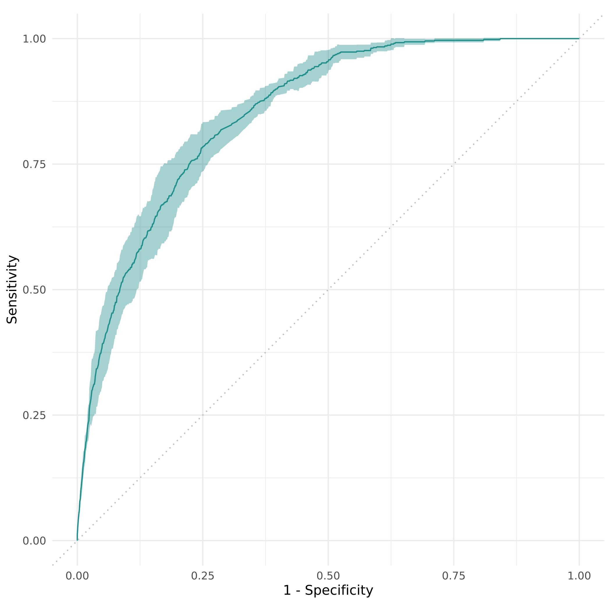

``` r
DEVICE = "cuda"
library("mlr3")
options(mlr3torch.cache = "/mnt/data/mlr3torch_cache")
lgr::get_logger("mlr3")$set_threshold("warn")
set.seed(42)
task <- tsk("mtcars")
learner <- lrn("regr.rpart")
split <- partition(task, ratio = 2/3)
learner$train(task, split$train)
pred <- learner$predict(task, split$test)
pred$score(msr("regr.rmse"))
```

```
## regr.rmse 
##  4.736051
```

``` r
library("mlr3pipelines")
graph_learner <- as_learner(po("pca") %>>% lrn("regr.rpart"))

resampling <- rsmp("cv", folds = 3)
rr <- resample(task, graph_learner, resampling)
rr$aggregate(msr("regr.rmse"))
```

```
## regr.rmse 
##  4.274766
```

``` r
library("torch")
torch_manual_seed(42)
x <- torch_tensor(1, device = DEVICE)
```

```
## Error in torch_tensor_cpp(data, dtype, device, requires_grad, pin_memory): PyTorch is not linked with support for cuda devices
## Exception raised from getDeviceGuardImpl at ../c10/core/impl/DeviceGuardImplInterface.h:356 (most recent call first):
## frame #0: c10::Error::Error(c10::SourceLocation, std::__cxx11::basic_string<char, std::char_traits<char>, std::allocator<char> >) + 0xb0 (0x7f4ce5ca8120 in /usr/local/lib/R/site-library/torch/lib/libc10.so)
## frame #1: c10::detail::torchCheckFail(char const*, char const*, unsigned int, std::__cxx11::basic_string<char, std::char_traits<char>, std::allocator<char> > const&) + 0xfa (0x7f4ce5c4ba5a in /usr/local/lib/R/site-library/torch/lib/libc10.so)
## frame #2: <unknown function> + 0x1b8bf42 (0x7f4cd283cf42 in /usr/local/lib/R/site-library/torch/lib/libtorch_cpu.so)
## frame #3: at::native::to(at::Tensor const&, std::optional<c10::ScalarType>, std::optional<c10::Layout>, std::optional<c10::Device>, std::optional<bool>, bool, bool, std::optional<c10::MemoryFormat>) + 0x16c (0x7f4cd2d764ec in /usr/local/lib/R/site-library/torch/lib/libtorch_cpu.so)
## frame #4: <unknown function> + 0x32b6785 (0x7f4cd3f67785 in /usr/local/lib/R/site-library/torch/lib/libtorch_cpu.so)
## frame #5: at::_ops::to_dtype_layout::call(at::Tensor const&, std::optional<c10::ScalarType>, std::optional<c10::Layout>, std::optional<c10::Device>, std::optional<bool>, bool, bool, std::optional<c10::MemoryFormat>) + 0x213 (0x7f4cd3579a63 in /usr/local/lib/R/site-library/torch/lib/libtorch_cpu.so)
## frame #6: at::Tensor::to(c10::TensorOptions, bool, bool, std::optional<c10::MemoryFormat>) const + 0xf7 (0x7f4ce694de1f in /usr/local/lib/R/site-library/torch/lib/liblantern.so)
## frame #7: _lantern_Tensor_to + 0x8b (0x7f4ce69cf37b in /usr/local/lib/R/site-library/torch/lib/liblantern.so)
## frame #8: torch_tensor_cpp(SEXPREC*, Rcpp::Nullable<XPtrTorchDtype>, Rcpp::Nullable<XPtrTorchDevice>, bool, bool) + 0x69f (0x7f4ce76eed7f in /usr/local/lib/R/site-library/torch/libs/torchpkg.so)
## frame #9: _torch_torch_tensor_cpp + 0xbe (0x7f4ce75bdb5e in /usr/local/lib/R/site-library/torch/libs/torchpkg.so)
## frame #10: <unknown function> + 0x1034fe (0x7f4f0b2a54fe in /usr/local/lib/R/lib/libR.so)
## frame #11: <unknown function> + 0x149718 (0x7f4f0b2eb718 in /usr/local/lib/R/lib/libR.so)
## frame #12: <unknown function> + 0x151a5a (0x7f4f0b2f3a5a in /usr/local/lib/R/lib/libR.so)
## frame #13: Rf_eval + 0x17b (0x7f4f0b2f3e2b in /usr/local/lib/R/lib/libR.so)
## frame #14: <unknown function> + 0x15406e (0x7f4f0b2f606e in /usr/local/lib/R/lib/libR.so)
## frame #15: <unknown function> + 0x154dc7 (0x7f4f0b2f6dc7 in /usr/local/lib/R/lib/libR.so)
## frame #16: Rf_eval + 0x2b6 (0x7f4f0b2f3f66 in /usr/local/lib/R/lib/libR.so)
## frame #17: <unknown function> + 0x157174 (0x7f4f0b2f9174 in /usr/local/lib/R/lib/libR.so)
## frame #18: Rf_eval + 0x560 (0x7f4f0b2f4210 in /usr/local/lib/R/lib/libR.so)
## frame #19: <unknown function> + 0x1585f7 (0x7f4f0b2fa5f7 in /usr/local/lib/R/lib/libR.so)
## frame #20: <unknown function> + 0x144dd5 (0x7f4f0b2e6dd5 in /usr/local/lib/R/lib/libR.so)
## frame #21: <unknown function> + 0x151a5a (0x7f4f0b2f3a5a in /usr/local/lib/R/lib/libR.so)
## frame #22: Rf_eval + 0x17b (0x7f4f0b2f3e2b in /usr/local/lib/R/lib/libR.so)
## frame #23: <unknown function> + 0x15279b (0x7f4f0b2f479b in /usr/local/lib/R/lib/libR.so)
## frame #24: Rf_eval + 0x386 (0x7f4f0b2f4036 in /usr/local/lib/R/lib/libR.so)
## frame #25: <unknown function> + 0x158f60 (0x7f4f0b2faf60 in /usr/local/lib/R/lib/libR.so)
## frame #26: <unknown function> + 0x19e45b (0x7f4f0b34045b in /usr/local/lib/R/lib/libR.so)
## frame #27: <unknown function> + 0x144bcc (0x7f4f0b2e6bcc in /usr/local/lib/R/lib/libR.so)
## frame #28: <unknown function> + 0x151a5a (0x7f4f0b2f3a5a in /usr/local/lib/R/lib/libR.so)
## frame #29: Rf_eval + 0x17b (0x7f4f0b2f3e2b in /usr/local/lib/R/lib/libR.so)
## frame #30: <unknown function> + 0x15279b (0x7f4f0b2f479b in /usr/local/lib/R/lib/libR.so)
## frame #31: Rf_eval + 0x386 (0x7f4f0b2f4036 in /usr/local/lib/R/lib/libR.so)
## frame #32: <unknown function> + 0x15279b (0x7f4f0b2f479b in /usr/local/lib/R/lib/libR.so)
## frame #33: <unknown function> + 0x152a91 (0x7f4f0b2f4a91 in /usr/local/lib/R/lib/libR.so)
## frame #34: <unknown function> + 0x149be3 (0x7f4f0b2ebbe3 in /usr/local/lib/R/lib/libR.so)
## frame #35: <unknown function> + 0x151a5a (0x7f4f0b2f3a5a in /usr/local/lib/R/lib/libR.so)
## frame #36: Rf_eval + 0x17b (0x7f4f0b2f3e2b in /usr/local/lib/R/lib/libR.so)
## frame #37: <unknown function> + 0x15406e (0x7f4f0b2f606e in /usr/local/lib/R/lib/libR.so)
## frame #38: <unknown function> + 0x154dc7 (0x7f4f0b2f6dc7 in /usr/local/lib/R/lib/libR.so)
## frame #39: Rf_eval + 0x2b6 (0x7f4f0b2f3f66 in /usr/local/lib/R/lib/libR.so)
## frame #40: <unknown function> + 0x1585f7 (0x7f4f0b2fa5f7 in /usr/local/lib/R/lib/libR.so)
## frame #41: <unknown function> + 0x144dd5 (0x7f4f0b2e6dd5 in /usr/local/lib/R/lib/libR.so)
## frame #42: <unknown function> + 0x151a5a (0x7f4f0b2f3a5a in /usr/local/lib/R/lib/libR.so)
## frame #43: Rf_eval + 0x17b (0x7f4f0b2f3e2b in /usr/local/lib/R/lib/libR.so)
## frame #44: <unknown function> + 0x15406e (0x7f4f0b2f606e in /usr/local/lib/R/lib/libR.so)
## frame #45: <unknown function> + 0x154dc7 (0x7f4f0b2f6dc7 in /usr/local/lib/R/lib/libR.so)
## frame #46: Rf_eval + 0x2b6 (0x7f4f0b2f3f66 in /usr/local/lib/R/lib/libR.so)
## frame #47: <unknown function> + 0x18c161 (0x7f4f0b32e161 in /usr/local/lib/R/lib/libR.so)
## frame #48: <unknown function> + 0x18c4e8 (0x7f4f0b32e4e8 in /usr/local/lib/R/lib/libR.so)
## frame #49: run_Rmainloop + 0x50 (0x7f4f0b32e5a0 in /usr/local/lib/R/lib/libR.so)
## frame #50: main + 0x1f (0x55b9ad7ae09f in /usr/local/lib/R/bin/exec/R)
## frame #51: <unknown function> + 0x2a1ca (0x7f4f0afba1ca in /usr/lib/x86_64-linux-gnu/libc.so.6)
## frame #52: __libc_start_main + 0x8b (0x7f4f0afba28b in /usr/lib/x86_64-linux-gnu/libc.so.6)
## frame #53: _start + 0x25 (0x55b9ad7ae0d5 in /usr/local/lib/R/bin/exec/R)
```

``` r
w <- torch_tensor(2, requires_grad = TRUE, device = DEVICE)
```

```
## Error in torch_tensor_cpp(data, dtype, device, requires_grad, pin_memory): PyTorch is not linked with support for cuda devices
## Exception raised from getDeviceGuardImpl at ../c10/core/impl/DeviceGuardImplInterface.h:356 (most recent call first):
## frame #0: c10::Error::Error(c10::SourceLocation, std::__cxx11::basic_string<char, std::char_traits<char>, std::allocator<char> >) + 0xb0 (0x7f4ce5ca8120 in /usr/local/lib/R/site-library/torch/lib/libc10.so)
## frame #1: c10::detail::torchCheckFail(char const*, char const*, unsigned int, std::__cxx11::basic_string<char, std::char_traits<char>, std::allocator<char> > const&) + 0xfa (0x7f4ce5c4ba5a in /usr/local/lib/R/site-library/torch/lib/libc10.so)
## frame #2: <unknown function> + 0x1b8bf42 (0x7f4cd283cf42 in /usr/local/lib/R/site-library/torch/lib/libtorch_cpu.so)
## frame #3: at::native::to(at::Tensor const&, std::optional<c10::ScalarType>, std::optional<c10::Layout>, std::optional<c10::Device>, std::optional<bool>, bool, bool, std::optional<c10::MemoryFormat>) + 0x16c (0x7f4cd2d764ec in /usr/local/lib/R/site-library/torch/lib/libtorch_cpu.so)
## frame #4: <unknown function> + 0x32b6785 (0x7f4cd3f67785 in /usr/local/lib/R/site-library/torch/lib/libtorch_cpu.so)
## frame #5: at::_ops::to_dtype_layout::call(at::Tensor const&, std::optional<c10::ScalarType>, std::optional<c10::Layout>, std::optional<c10::Device>, std::optional<bool>, bool, bool, std::optional<c10::MemoryFormat>) + 0x213 (0x7f4cd3579a63 in /usr/local/lib/R/site-library/torch/lib/libtorch_cpu.so)
## frame #6: at::Tensor::to(c10::TensorOptions, bool, bool, std::optional<c10::MemoryFormat>) const + 0xf7 (0x7f4ce694de1f in /usr/local/lib/R/site-library/torch/lib/liblantern.so)
## frame #7: _lantern_Tensor_to + 0x8b (0x7f4ce69cf37b in /usr/local/lib/R/site-library/torch/lib/liblantern.so)
## frame #8: torch_tensor_cpp(SEXPREC*, Rcpp::Nullable<XPtrTorchDtype>, Rcpp::Nullable<XPtrTorchDevice>, bool, bool) + 0x69f (0x7f4ce76eed7f in /usr/local/lib/R/site-library/torch/libs/torchpkg.so)
## frame #9: _torch_torch_tensor_cpp + 0xbe (0x7f4ce75bdb5e in /usr/local/lib/R/site-library/torch/libs/torchpkg.so)
## frame #10: <unknown function> + 0x1034fe (0x7f4f0b2a54fe in /usr/local/lib/R/lib/libR.so)
## frame #11: <unknown function> + 0x149718 (0x7f4f0b2eb718 in /usr/local/lib/R/lib/libR.so)
## frame #12: <unknown function> + 0x151a5a (0x7f4f0b2f3a5a in /usr/local/lib/R/lib/libR.so)
## frame #13: Rf_eval + 0x17b (0x7f4f0b2f3e2b in /usr/local/lib/R/lib/libR.so)
## frame #14: <unknown function> + 0x15406e (0x7f4f0b2f606e in /usr/local/lib/R/lib/libR.so)
## frame #15: <unknown function> + 0x154dc7 (0x7f4f0b2f6dc7 in /usr/local/lib/R/lib/libR.so)
## frame #16: Rf_eval + 0x2b6 (0x7f4f0b2f3f66 in /usr/local/lib/R/lib/libR.so)
## frame #17: <unknown function> + 0x157174 (0x7f4f0b2f9174 in /usr/local/lib/R/lib/libR.so)
## frame #18: Rf_eval + 0x560 (0x7f4f0b2f4210 in /usr/local/lib/R/lib/libR.so)
## frame #19: <unknown function> + 0x1585f7 (0x7f4f0b2fa5f7 in /usr/local/lib/R/lib/libR.so)
## frame #20: <unknown function> + 0x144dd5 (0x7f4f0b2e6dd5 in /usr/local/lib/R/lib/libR.so)
## frame #21: <unknown function> + 0x151a5a (0x7f4f0b2f3a5a in /usr/local/lib/R/lib/libR.so)
## frame #22: Rf_eval + 0x17b (0x7f4f0b2f3e2b in /usr/local/lib/R/lib/libR.so)
## frame #23: <unknown function> + 0x15279b (0x7f4f0b2f479b in /usr/local/lib/R/lib/libR.so)
## frame #24: Rf_eval + 0x386 (0x7f4f0b2f4036 in /usr/local/lib/R/lib/libR.so)
## frame #25: <unknown function> + 0x158f60 (0x7f4f0b2faf60 in /usr/local/lib/R/lib/libR.so)
## frame #26: <unknown function> + 0x19e45b (0x7f4f0b34045b in /usr/local/lib/R/lib/libR.so)
## frame #27: <unknown function> + 0x144bcc (0x7f4f0b2e6bcc in /usr/local/lib/R/lib/libR.so)
## frame #28: <unknown function> + 0x151a5a (0x7f4f0b2f3a5a in /usr/local/lib/R/lib/libR.so)
## frame #29: Rf_eval + 0x17b (0x7f4f0b2f3e2b in /usr/local/lib/R/lib/libR.so)
## frame #30: <unknown function> + 0x15279b (0x7f4f0b2f479b in /usr/local/lib/R/lib/libR.so)
## frame #31: Rf_eval + 0x386 (0x7f4f0b2f4036 in /usr/local/lib/R/lib/libR.so)
## frame #32: <unknown function> + 0x15279b (0x7f4f0b2f479b in /usr/local/lib/R/lib/libR.so)
## frame #33: <unknown function> + 0x152a91 (0x7f4f0b2f4a91 in /usr/local/lib/R/lib/libR.so)
## frame #34: <unknown function> + 0x149be3 (0x7f4f0b2ebbe3 in /usr/local/lib/R/lib/libR.so)
## frame #35: <unknown function> + 0x151a5a (0x7f4f0b2f3a5a in /usr/local/lib/R/lib/libR.so)
## frame #36: Rf_eval + 0x17b (0x7f4f0b2f3e2b in /usr/local/lib/R/lib/libR.so)
## frame #37: <unknown function> + 0x15406e (0x7f4f0b2f606e in /usr/local/lib/R/lib/libR.so)
## frame #38: <unknown function> + 0x154dc7 (0x7f4f0b2f6dc7 in /usr/local/lib/R/lib/libR.so)
## frame #39: Rf_eval + 0x2b6 (0x7f4f0b2f3f66 in /usr/local/lib/R/lib/libR.so)
## frame #40: <unknown function> + 0x1585f7 (0x7f4f0b2fa5f7 in /usr/local/lib/R/lib/libR.so)
## frame #41: <unknown function> + 0x144dd5 (0x7f4f0b2e6dd5 in /usr/local/lib/R/lib/libR.so)
## frame #42: <unknown function> + 0x151a5a (0x7f4f0b2f3a5a in /usr/local/lib/R/lib/libR.so)
## frame #43: Rf_eval + 0x17b (0x7f4f0b2f3e2b in /usr/local/lib/R/lib/libR.so)
## frame #44: <unknown function> + 0x15406e (0x7f4f0b2f606e in /usr/local/lib/R/lib/libR.so)
## frame #45: <unknown function> + 0x154dc7 (0x7f4f0b2f6dc7 in /usr/local/lib/R/lib/libR.so)
## frame #46: Rf_eval + 0x2b6 (0x7f4f0b2f3f66 in /usr/local/lib/R/lib/libR.so)
## frame #47: <unknown function> + 0x18c161 (0x7f4f0b32e161 in /usr/local/lib/R/lib/libR.so)
## frame #48: <unknown function> + 0x18c4e8 (0x7f4f0b32e4e8 in /usr/local/lib/R/lib/libR.so)
## frame #49: run_Rmainloop + 0x50 (0x7f4f0b32e5a0 in /usr/local/lib/R/lib/libR.so)
## frame #50: main + 0x1f (0x55b9ad7ae09f in /usr/local/lib/R/bin/exec/R)
## frame #51: <unknown function> + 0x2a1ca (0x7f4f0afba1ca in /usr/lib/x86_64-linux-gnu/libc.so.6)
## frame #52: __libc_start_main + 0x8b (0x7f4f0afba28b in /usr/lib/x86_64-linux-gnu/libc.so.6)
## frame #53: _start + 0x25 (0x55b9ad7ae0d5 in /usr/local/lib/R/bin/exec/R)
```

``` r
y <- w * x
y$backward()
w$grad
```

```
## torch_tensor
##  2
## [ CPUFloatType{1} ]
```

``` r
library("mlr3torch")
mnist <- tsk("mnist")
mnist
```

```
## 
## ── <TaskClassif> (70000x2): MNIST Digit Classification ─────────────────────────────────────────────────────────────────────────────────────────────────────────────────────────────────────────────────────────────────
## • Target: label
## • Target classes: 1 (11%), 7 (10%), 3 (10%), 2 (10%), 9 (10%), 0 (10%), 6 (10%), 8 (10%), 4 (10%), 5 (9%)
## • Properties: multiclass
## • Features (1):
##   • lt (1): image
```

``` r
rows <- mnist$data(1:2)
rows
```

```
##     label           image
##    <fctr>   <lazy_tensor>
## 1:      5 <tnsr[1x28x28]>
## 2:      0 <tnsr[1x28x28]>
```

``` r
str(materialize(rows$image))
```

```
## List of 2
##  $ :Float [1:1, 1:28, 1:28]
##  $ :Float [1:1, 1:28, 1:28]
```

``` r
po_flat <- po("trafo_reshape", shape = c(-1, 28 * 28))
mnist_flat <- po_flat$train(list(mnist))[[1L]]
mnist_flat$head(2)
```

```
##     label         image
##    <fctr> <lazy_tensor>
## 1:      5   <tnsr[784]>
## 2:      0   <tnsr[784]>
```

``` r
mlp <- lrn("classif.mlp",
 loss = t_loss("cross_entropy"),
 optimizer = t_opt("adamw", lr = 0.01),
 callbacks = t_clbk("history"))

mlp$param_set$set_values(
  neurons = c(100, 200), activation = torch::nn_relu,
  p = 0.3, opt.weight_decay = 0.01, measures_train = msr("classif.logloss"),
  epochs = 0, batch_size = 1, device = DEVICE)

mlp$configure(
  predict_type = "prob",
  epochs = 1)

mlp$train(mnist_flat, row_ids = 1)
```

```
## Error in (function (self, device, dtype, non_blocking, copy, memory_format) : PyTorch is not linked with support for cuda devices
## Exception raised from getDeviceGuardImpl at ../c10/core/impl/DeviceGuardImplInterface.h:356 (most recent call first):
## frame #0: c10::Error::Error(c10::SourceLocation, std::__cxx11::basic_string<char, std::char_traits<char>, std::allocator<char> >) + 0xb0 (0x7f4ce5ca8120 in /usr/local/lib/R/site-library/torch/lib/libc10.so)
## frame #1: c10::detail::torchCheckFail(char const*, char const*, unsigned int, std::__cxx11::basic_string<char, std::char_traits<char>, std::allocator<char> > const&) + 0xfa (0x7f4ce5c4ba5a in /usr/local/lib/R/site-library/torch/lib/libc10.so)
## frame #2: <unknown function> + 0x1b8bf42 (0x7f4cd283cf42 in /usr/local/lib/R/site-library/torch/lib/libtorch_cpu.so)
## frame #3: at::native::to(at::Tensor const&, c10::Device, c10::ScalarType, bool, bool, std::optional<c10::MemoryFormat>) + 0x10c (0x7f4cd2d7672c in /usr/local/lib/R/site-library/torch/lib/libtorch_cpu.so)
## frame #4: <unknown function> + 0x32b67ed (0x7f4cd3f677ed in /usr/local/lib/R/site-library/torch/lib/libtorch_cpu.so)
## frame #5: at::_ops::to_device::call(at::Tensor const&, c10::Device, c10::ScalarType, bool, bool, std::optional<c10::MemoryFormat>) + 0x1ce (0x7f4cd3579f8e in /usr/local/lib/R/site-library/torch/lib/libtorch_cpu.so)
## frame #6: at::Tensor::to(c10::Device, c10::ScalarType, bool, bool, std::optional<c10::MemoryFormat>) const + 0x67 (0x7f4ce694deb1 in /usr/local/lib/R/site-library/torch/lib/liblantern.so)
## frame #7: _lantern_Tensor_to_tensor_device_scalartype_bool_bool_memoryformat + 0xda (0x7f4ce66893dc in /usr/local/lib/R/site-library/torch/lib/liblantern.so)
## frame #8: cpp_torch_method_to_self_Tensor_device_Device_dtype_ScalarType(XPtrTorchTensor, XPtrTorchDevice, XPtrTorchDtype, XPtrTorchbool, XPtrTorchbool, XPtrTorchoptional_memory_format) + 0x3c (0x7f4ce762afcc in /usr/local/lib/R/site-library/torch/libs/torchpkg.so)
## frame #9: _torch_cpp_torch_method_to_self_Tensor_device_Device_dtype_ScalarType + 0x11e (0x7f4ce735f86e in /usr/local/lib/R/site-library/torch/libs/torchpkg.so)
## frame #10: <unknown function> + 0x1034da (0x7f4f0b2a54da in /usr/local/lib/R/lib/libR.so)
## frame #11: <unknown function> + 0x149718 (0x7f4f0b2eb718 in /usr/local/lib/R/lib/libR.so)
## frame #12: <unknown function> + 0x151a5a (0x7f4f0b2f3a5a in /usr/local/lib/R/lib/libR.so)
## frame #13: Rf_eval + 0x17b (0x7f4f0b2f3e2b in /usr/local/lib/R/lib/libR.so)
## frame #14: <unknown function> + 0x15406e (0x7f4f0b2f606e in /usr/local/lib/R/lib/libR.so)
## frame #15: <unknown function> + 0x154dc7 (0x7f4f0b2f6dc7 in /usr/local/lib/R/lib/libR.so)
## frame #16: Rf_eval + 0x2b6 (0x7f4f0b2f3f66 in /usr/local/lib/R/lib/libR.so)
## frame #17: <unknown function> + 0xcb26f (0x7f4f0b26d26f in /usr/local/lib/R/lib/libR.so)
## frame #18: <unknown function> + 0x144dd5 (0x7f4f0b2e6dd5 in /usr/local/lib/R/lib/libR.so)
## frame #19: <unknown function> + 0x151a5a (0x7f4f0b2f3a5a in /usr/local/lib/R/lib/libR.so)
## frame #20: Rf_eval + 0x17b (0x7f4f0b2f3e2b in /usr/local/lib/R/lib/libR.so)
## frame #21: <unknown function> + 0x15406e (0x7f4f0b2f606e in /usr/local/lib/R/lib/libR.so)
## frame #22: <unknown function> + 0x154dc7 (0x7f4f0b2f6dc7 in /usr/local/lib/R/lib/libR.so)
## frame #23: Rf_eval + 0x2b6 (0x7f4f0b2f3f66 in /usr/local/lib/R/lib/libR.so)
## frame #24: <unknown function> + 0x155b4c (0x7f4f0b2f7b4c in /usr/local/lib/R/lib/libR.so)
## frame #25: Rf_eval + 0x560 (0x7f4f0b2f4210 in /usr/local/lib/R/lib/libR.so)
## frame #26: Rf_eval + 0x560 (0x7f4f0b2f4210 in /usr/local/lib/R/lib/libR.so)
## frame #27: <unknown function> + 0x155b4c (0x7f4f0b2f7b4c in /usr/local/lib/R/lib/libR.so)
## frame #28: Rf_eval + 0x560 (0x7f4f0b2f4210 in /usr/local/lib/R/lib/libR.so)
## frame #29: <unknown function> + 0x15406e (0x7f4f0b2f606e in /usr/local/lib/R/lib/libR.so)
## frame #30: <unknown function> + 0x154dc7 (0x7f4f0b2f6dc7 in /usr/local/lib/R/lib/libR.so)
## frame #31: Rf_eval + 0x2b6 (0x7f4f0b2f3f66 in /usr/local/lib/R/lib/libR.so)
## frame #32: <unknown function> + 0x157174 (0x7f4f0b2f9174 in /usr/local/lib/R/lib/libR.so)
## frame #33: Rf_eval + 0x560 (0x7f4f0b2f4210 in /usr/local/lib/R/lib/libR.so)
## frame #34: <unknown function> + 0x155b4c (0x7f4f0b2f7b4c in /usr/local/lib/R/lib/libR.so)
## frame #35: Rf_eval + 0x560 (0x7f4f0b2f4210 in /usr/local/lib/R/lib/libR.so)
## frame #36: <unknown function> + 0x15279b (0x7f4f0b2f479b in /usr/local/lib/R/lib/libR.so)
## frame #37: <unknown function> + 0x152a91 (0x7f4f0b2f4a91 in /usr/local/lib/R/lib/libR.so)
## frame #38: <unknown function> + 0x149be3 (0x7f4f0b2ebbe3 in /usr/local/lib/R/lib/libR.so)
## frame #39: <unknown function> + 0x151a5a (0x7f4f0b2f3a5a in /usr/local/lib/R/lib/libR.so)
## frame #40: Rf_eval + 0x17b (0x7f4f0b2f3e2b in /usr/local/lib/R/lib/libR.so)
## frame #41: <unknown function> + 0x15406e (0x7f4f0b2f606e in /usr/local/lib/R/lib/libR.so)
## frame #42: <unknown function> + 0x154dc7 (0x7f4f0b2f6dc7 in /usr/local/lib/R/lib/libR.so)
## frame #43: Rf_eval + 0x2b6 (0x7f4f0b2f3f66 in /usr/local/lib/R/lib/libR.so)
## frame #44: <unknown function> + 0x155b4c (0x7f4f0b2f7b4c in /usr/local/lib/R/lib/libR.so)
## frame #45: Rf_eval + 0x560 (0x7f4f0b2f4210 in /usr/local/lib/R/lib/libR.so)
## frame #46: Rf_eval + 0x560 (0x7f4f0b2f4210 in /usr/local/lib/R/lib/libR.so)
## frame #47: <unknown function> + 0x155b4c (0x7f4f0b2f7b4c in /usr/local/lib/R/lib/libR.so)
## frame #48: Rf_eval + 0x560 (0x7f4f0b2f4210 in /usr/local/lib/R/lib/libR.so)
## frame #49: <unknown function> + 0x15a65b (0x7f4f0b2fc65b in /usr/local/lib/R/lib/libR.so)
## frame #50: Rf_eval + 0x560 (0x7f4f0b2f4210 in /usr/local/lib/R/lib/libR.so)
## frame #51: <unknown function> + 0x155b4c (0x7f4f0b2f7b4c in /usr/local/lib/R/lib/libR.so)
## frame #52: Rf_eval + 0x560 (0x7f4f0b2f4210 in /usr/local/lib/R/lib/libR.so)
## frame #53: <unknown function> + 0x15406e (0x7f4f0b2f606e in /usr/local/lib/R/lib/libR.so)
## frame #54: <unknown function> + 0x154dc7 (0x7f4f0b2f6dc7 in /usr/local/lib/R/lib/libR.so)
## frame #55: Rf_eval + 0x2b6 (0x7f4f0b2f3f66 in /usr/local/lib/R/lib/libR.so)
## frame #56: <unknown function> + 0x155b4c (0x7f4f0b2f7b4c in /usr/local/lib/R/lib/libR.so)
## frame #57: Rf_eval + 0x560 (0x7f4f0b2f4210 in /usr/local/lib/R/lib/libR.so)
## frame #58: <unknown function> + 0x15a65b (0x7f4f0b2fc65b in /usr/local/lib/R/lib/libR.so)
## frame #59: Rf_eval + 0x560 (0x7f4f0b2f4210 in /usr/local/lib/R/lib/libR.so)
## frame #60: <unknown function> + 0x155b4c (0x7f4f0b2f7b4c in /usr/local/lib/R/lib/libR.so)
## frame #61: Rf_eval + 0x560 (0x7f4f0b2f4210 in /usr/local/lib/R/lib/libR.so)
## frame #62: <unknown function> + 0x15406e (0x7f4f0b2f606e in /usr/local/lib/R/lib/libR.so)
```

``` r
mlp$model$network
```

```
## NULL
```

``` r
head(mlp$model$callbacks$history, n = 2)
```

```
## NULL
```

``` r
pred <- mlp$predict(mnist_flat, row_ids = 2)
```

```
## Error in mlp$predict(mnist_flat, row_ids = 2): Cannot predict, Learner 'classif.mlp' has not been trained yet
```

``` r
pred$score(msr("classif.ce"))
```

```
## Error in m$score(prediction = self, task = task, learner = learner, train_set = train_set): Measure 'classif.ce' incompatible with task type 'regr'
```

``` r
pth <- tempfile()
mlp$marshal()
saveRDS(mlp, pth)
mlp2 <- readRDS(pth)
mlp2$unmarshal()

set_validate(mlp, validate = 0.3)

nn_simple <- nn_module("nn_simple",
  initialize = function(d_in, d_latent, d_out) {
    self$linear1 = nn_linear(d_in, d_latent)
    self$activation = nn_relu()
    self$linear2 = nn_linear(d_latent, d_out)
  },
  forward = function(x) {
    x = self$linear1(x)
    x = self$activation(x)
    self$linear2(x)
  }
)

net <- nn_simple(10, 100, 1)

net(torch_randn(1, 10))
```

```
## torch_tensor
## 0.01 *
## -9.4603
## [ CPUFloatType{1,1} ][ grad_fn = <AddmmBackward0> ]
```

``` r
module_graph <- po("module_1", module = nn_linear(10, 100)) %>>%
 po("module_2", module = nn_relu()) %>>%
 po("module_3", module = nn_linear(100, 1))

net <- nn_graph(module_graph, shapes_in = list(module_1.input = c(NA, 10)))
net(torch_randn(2, 10))
```

```
## torch_tensor
## -0.1218
## -0.0636
## [ CPUFloatType{2,1} ][ grad_fn = <AddmmBackward0> ]
```

``` r
graph <- po("torch_ingress_ltnsr") %>>%
  nn("linear", out_features = 10) %>>% nn("relu") %>>% nn("head")

md <- graph$train(mnist_flat)[[1L]]
md
```

```
## <ModelDescriptor: 4 ops>
## * Ingress:  torch_ingress_ltnsr.input: [(NA,784)]
## * Task:  mnist [classif]
## * Callbacks:  N/A
## * Optimizer:  N/A
## * Loss:  N/A
## * pointer:  head.output [(NA,10)]
```

``` r
graph <- graph %>>%
  po("torch_loss", t_loss("cross_entropy")) %>>%
  po("torch_optimizer", t_opt("adamw", lr = 0.001))

graph <- graph %>>% po("torch_model_classif", epochs = 1L, batch_size = 1L)

glrn <- as_learner(graph)
glrn$train(mnist_flat, row_ids = 1L)

path_lin <- nn("linear_1")
path_nonlin <- nn("linear_2") %>>% nn("relu")

residual_layer <- list(path_lin, path_nonlin) %>>% nn("merge_sum")

path_num <- po("select_1", selector = selector_type("numeric")) %>>%
  po("torch_ingress_num") %>>%
  nn("tokenizer_num", d_token = 10)
path_categ <- po("select_2", selector = selector_type("factor")) %>>%
  po("torch_ingress_categ") %>>%
  nn("tokenizer_categ", d_token = 10)

graph <- list(path_num, path_categ) %>>% nn("merge_cat", dim = 2)

blocks <- nn("block", residual_layer, n_blocks = 5)

nn_winsorized_mse <- nn_module(c("nn_winsorized_mse", "nn_loss"),
  initialize = function(max_loss) {
    self$max_loss <- max_loss
  },
  forward = function(input, target) {
    torch_clamp(nnf_mse_loss(input, target), max = self$max_loss)
  }
)
tloss <- as_torch_loss(nn_winsorized_mse)
tloss
```

```
## <TorchLoss:nn_winsorized_mse> nn_winsorized_mse
## * Generator: nn_winsorized_mse
## * Parameters: list()
## * Packages: torch,mlr3torch
## * Task Types: classif,regr
```

``` r
gradient_clipper <- torch_callback("gradient_clipper",
  initialize = function(max_norm, norm_type) {
    self$norms <- numeric()
    self$max_norm <- max_norm
    self$norm_type <- norm_type
  },
  on_after_backward = function() {
    norm <- nn_utils_clip_grad_norm_(self$ctx$network$parameters,
      self$max_norm, self$norm_type)
    self$norms <- c(self$norms, norm$item())
  },
  state_dict = function() {
    self$norms
  },
  load_state_dict = function(state_dict) {
    self$norms = state_dict
  }
)

nn_ffn <- nn_module("nn_ffn",
  initialize = function(task, latent_dim, n_layers) {
    dims <- c(task$n_features, rep(latent_dim, n_layers),
      length(task$class_names))
    modules <- unlist(lapply(seq_len(length(dims) - 1), function(i) {
      if (i < length(dims) - 1) {
        list(nn_linear(dims[i], dims[i + 1]), nn_relu())
      } else {
        list(nn_linear(dims[i], dims[i + 1]))
      }
    }), recursive = FALSE)
    self$network <- do.call(nn_sequential, modules)
  },
  forward = function(x) self$network(x)
)

num_input <- list(x = ingress_num())
num_input
```

```
## $x
## Ingress: Task[selector_type(c("numeric", "integer"))] --> Tensor()
```

``` r
lrn_ffn <- lrn("classif.module",
  module_generator = nn_ffn,
  ingress_tokens = num_input,
  latent_dim = 100, n_layers = 5)

task <- tsk("california_housing")
task
```

```
## 
## ── <TaskRegr> (20640x10): California House Value ───────────────────────────────────────────────────────────────────────────────────────────────────────────────────────────────────────────────────────────────────────
## • Target: median_house_value
## • Properties: -
## • Features (9):
##   • dbl (8): households, housing_median_age, latitude, longitude, median_income, population, total_bedrooms, total_rooms
##   • fct (1): ocean_proximity
```

``` r
preprocessing <- po("encode", method = "one-hot") %>>%
  po("imputehist")

ingress <- po("torch_ingress_num")

block <- nn("linear", out_features = 32) %>>%
  ppl("branch", list(relu = nn("relu"), sigmoid = nn("sigmoid"))) %>>%
  nn("dropout")

architecture <- nn("block", block) %>>% nn("head")

config <- po("torch_loss", loss = t_loss("mse")) %>>%
  po("torch_optimizer", optimizer = t_opt("adamw"))

model <- po("torch_model_regr", device = DEVICE, batch_size = 512)

pipeline <- preprocessing %>>% ingress %>>%
  architecture %>>% config %>>% model
learner = as_learner(pipeline)
learner$id = "custom_nn"

library("mlr3tuning")
learner$param_set$set_values(
  block.linear.out_features = to_tune(20, 500),
  block.n_blocks = to_tune(1, 5),
  block.branch.selection = to_tune(c("relu", "sigmoid")),
  block.dropout.p = to_tune(0.1, 0.9),
  torch_optimizer.lr = to_tune(10^-4, 10^-1, logscale = TRUE))

set_validate(learner, "test")

learner$param_set$set_values(
  torch_model_regr.patience = 1L,
  torch_model_regr.measures_valid = msr("regr.mse"),
  torch_model_regr.epochs = to_tune(upper = 1L, internal = TRUE))

library("mlr3mbo")
ti <- tune(
  tuner = tnr("random_search"),
  resampling = rsmp("holdout"),
  measure = msr("internal_valid_score", minimize = TRUE),
  learner = learner,
  term_evals = 1L,
  task = task)
```

```
## Warning: Caught Rcpp::exception. Canceling all iterations ...
```

```
## Error in (function (self, device, dtype, non_blocking, copy, memory_format) : PyTorch is not linked with support for cuda devices
## Exception raised from getDeviceGuardImpl at ../c10/core/impl/DeviceGuardImplInterface.h:356 (most recent call first):
## frame #0: c10::Error::Error(c10::SourceLocation, std::__cxx11::basic_string<char, std::char_traits<char>, std::allocator<char> >) + 0xb0 (0x7f4ce5ca8120 in /usr/local/lib/R/site-library/torch/lib/libc10.so)
## frame #1: c10::detail::torchCheckFail(char const*, char const*, unsigned int, std::__cxx11::basic_string<char, std::char_traits<char>, std::allocator<char> > const&) + 0xfa (0x7f4ce5c4ba5a in /usr/local/lib/R/site-library/torch/lib/libc10.so)
## frame #2: <unknown function> + 0x1b8bf42 (0x7f4cd283cf42 in /usr/local/lib/R/site-library/torch/lib/libtorch_cpu.so)
## frame #3: at::native::to(at::Tensor const&, c10::Device, c10::ScalarType, bool, bool, std::optional<c10::MemoryFormat>) + 0x10c (0x7f4cd2d7672c in /usr/local/lib/R/site-library/torch/lib/libtorch_cpu.so)
## frame #4: <unknown function> + 0x32b67ed (0x7f4cd3f677ed in /usr/local/lib/R/site-library/torch/lib/libtorch_cpu.so)
## frame #5: at::_ops::to_device::call(at::Tensor const&, c10::Device, c10::ScalarType, bool, bool, std::optional<c10::MemoryFormat>) + 0x1ce (0x7f4cd3579f8e in /usr/local/lib/R/site-library/torch/lib/libtorch_cpu.so)
## frame #6: at::Tensor::to(c10::Device, c10::ScalarType, bool, bool, std::optional<c10::MemoryFormat>) const + 0x67 (0x7f4ce694deb1 in /usr/local/lib/R/site-library/torch/lib/liblantern.so)
## frame #7: _lantern_Tensor_to_tensor_device_scalartype_bool_bool_memoryformat + 0xda (0x7f4ce66893dc in /usr/local/lib/R/site-library/torch/lib/liblantern.so)
## frame #8: cpp_torch_method_to_self_Tensor_device_Device_dtype_ScalarType(XPtrTorchTensor, XPtrTorchDevice, XPtrTorchDtype, XPtrTorchbool, XPtrTorchbool, XPtrTorchoptional_memory_format) + 0x3c (0x7f4ce762afcc in /usr/local/lib/R/site-library/torch/libs/torchpkg.so)
## frame #9: _torch_cpp_torch_method_to_self_Tensor_device_Device_dtype_ScalarType + 0x11e (0x7f4ce735f86e in /usr/local/lib/R/site-library/torch/libs/torchpkg.so)
## frame #10: <unknown function> + 0x1034da (0x7f4f0b2a54da in /usr/local/lib/R/lib/libR.so)
## frame #11: <unknown function> + 0x149718 (0x7f4f0b2eb718 in /usr/local/lib/R/lib/libR.so)
## frame #12: <unknown function> + 0x151a5a (0x7f4f0b2f3a5a in /usr/local/lib/R/lib/libR.so)
## frame #13: Rf_eval + 0x17b (0x7f4f0b2f3e2b in /usr/local/lib/R/lib/libR.so)
## frame #14: <unknown function> + 0x15406e (0x7f4f0b2f606e in /usr/local/lib/R/lib/libR.so)
## frame #15: <unknown function> + 0x154dc7 (0x7f4f0b2f6dc7 in /usr/local/lib/R/lib/libR.so)
## frame #16: Rf_eval + 0x2b6 (0x7f4f0b2f3f66 in /usr/local/lib/R/lib/libR.so)
## frame #17: <unknown function> + 0xcb26f (0x7f4f0b26d26f in /usr/local/lib/R/lib/libR.so)
## frame #18: <unknown function> + 0x144dd5 (0x7f4f0b2e6dd5 in /usr/local/lib/R/lib/libR.so)
## frame #19: <unknown function> + 0x151a5a (0x7f4f0b2f3a5a in /usr/local/lib/R/lib/libR.so)
## frame #20: Rf_eval + 0x17b (0x7f4f0b2f3e2b in /usr/local/lib/R/lib/libR.so)
## frame #21: <unknown function> + 0x15406e (0x7f4f0b2f606e in /usr/local/lib/R/lib/libR.so)
## frame #22: <unknown function> + 0x154dc7 (0x7f4f0b2f6dc7 in /usr/local/lib/R/lib/libR.so)
## frame #23: Rf_eval + 0x2b6 (0x7f4f0b2f3f66 in /usr/local/lib/R/lib/libR.so)
## frame #24: <unknown function> + 0x155b4c (0x7f4f0b2f7b4c in /usr/local/lib/R/lib/libR.so)
## frame #25: Rf_eval + 0x560 (0x7f4f0b2f4210 in /usr/local/lib/R/lib/libR.so)
## frame #26: Rf_eval + 0x560 (0x7f4f0b2f4210 in /usr/local/lib/R/lib/libR.so)
## frame #27: <unknown function> + 0x155b4c (0x7f4f0b2f7b4c in /usr/local/lib/R/lib/libR.so)
## frame #28: Rf_eval + 0x560 (0x7f4f0b2f4210 in /usr/local/lib/R/lib/libR.so)
## frame #29: <unknown function> + 0x15406e (0x7f4f0b2f606e in /usr/local/lib/R/lib/libR.so)
## frame #30: <unknown function> + 0x154dc7 (0x7f4f0b2f6dc7 in /usr/local/lib/R/lib/libR.so)
## frame #31: Rf_eval + 0x2b6 (0x7f4f0b2f3f66 in /usr/local/lib/R/lib/libR.so)
## frame #32: <unknown function> + 0x157174 (0x7f4f0b2f9174 in /usr/local/lib/R/lib/libR.so)
## frame #33: Rf_eval + 0x560 (0x7f4f0b2f4210 in /usr/local/lib/R/lib/libR.so)
## frame #34: <unknown function> + 0x155b4c (0x7f4f0b2f7b4c in /usr/local/lib/R/lib/libR.so)
## frame #35: Rf_eval + 0x560 (0x7f4f0b2f4210 in /usr/local/lib/R/lib/libR.so)
## frame #36: <unknown function> + 0x15279b (0x7f4f0b2f479b in /usr/local/lib/R/lib/libR.so)
## frame #37: <unknown function> + 0x152a91 (0x7f4f0b2f4a91 in /usr/local/lib/R/lib/libR.so)
## frame #38: <unknown function> + 0x149be3 (0x7f4f0b2ebbe3 in /usr/local/lib/R/lib/libR.so)
## frame #39: <unknown function> + 0x151a5a (0x7f4f0b2f3a5a in /usr/local/lib/R/lib/libR.so)
## frame #40: Rf_eval + 0x17b (0x7f4f0b2f3e2b in /usr/local/lib/R/lib/libR.so)
## frame #41: <unknown function> + 0x15406e (0x7f4f0b2f606e in /usr/local/lib/R/lib/libR.so)
## frame #42: <unknown function> + 0x154dc7 (0x7f4f0b2f6dc7 in /usr/local/lib/R/lib/libR.so)
## frame #43: Rf_eval + 0x2b6 (0x7f4f0b2f3f66 in /usr/local/lib/R/lib/libR.so)
## frame #44: <unknown function> + 0x155b4c (0x7f4f0b2f7b4c in /usr/local/lib/R/lib/libR.so)
## frame #45: Rf_eval + 0x560 (0x7f4f0b2f4210 in /usr/local/lib/R/lib/libR.so)
## frame #46: Rf_eval + 0x560 (0x7f4f0b2f4210 in /usr/local/lib/R/lib/libR.so)
## frame #47: <unknown function> + 0x155b4c (0x7f4f0b2f7b4c in /usr/local/lib/R/lib/libR.so)
## frame #48: Rf_eval + 0x560 (0x7f4f0b2f4210 in /usr/local/lib/R/lib/libR.so)
## frame #49: <unknown function> + 0x15a65b (0x7f4f0b2fc65b in /usr/local/lib/R/lib/libR.so)
## frame #50: Rf_eval + 0x560 (0x7f4f0b2f4210 in /usr/local/lib/R/lib/libR.so)
## frame #51: <unknown function> + 0x155b4c (0x7f4f0b2f7b4c in /usr/local/lib/R/lib/libR.so)
## frame #52: Rf_eval + 0x560 (0x7f4f0b2f4210 in /usr/local/lib/R/lib/libR.so)
## frame #53: <unknown function> + 0x15406e (0x7f4f0b2f606e in /usr/local/lib/R/lib/libR.so)
## frame #54: <unknown function> + 0x154dc7 (0x7f4f0b2f6dc7 in /usr/local/lib/R/lib/libR.so)
## frame #55: Rf_eval + 0x2b6 (0x7f4f0b2f3f66 in /usr/local/lib/R/lib/libR.so)
## frame #56: <unknown function> + 0x155b4c (0x7f4f0b2f7b4c in /usr/local/lib/R/lib/libR.so)
## frame #57: Rf_eval + 0x560 (0x7f4f0b2f4210 in /usr/local/lib/R/lib/libR.so)
## frame #58: <unknown function> + 0x15a65b (0x7f4f0b2fc65b in /usr/local/lib/R/lib/libR.so)
## frame #59: Rf_eval + 0x560 (0x7f4f0b2f4210 in /usr/local/lib/R/lib/libR.so)
## frame #60: <unknown function> + 0x155b4c (0x7f4f0b2f7b4c in /usr/local/lib/R/lib/libR.so)
## frame #61: Rf_eval + 0x560 (0x7f4f0b2f4210 in /usr/local/lib/R/lib/libR.so)
## frame #62: <unknown function> + 0x15406e (0x7f4f0b2f606e in /usr/local/lib/R/lib/libR.so)
## 
## This happened in PipeOp torch_model_regr's $train()
```

``` r
pvals <- ti$result_learner_param_vals[2:7]
cat(paste("*", names(pvals), "=", pvals,
 collapse = "\n"), "\n")
```

```
## * block.n_blocks = 1
## * block.linear.out_features = 446
## * block.branch.selection = sigmoid
## * block.dropout.p = 0.849683136679232
## * torch_optimizer.lr = 0.00145029336662848
## * torch_model_regr.epochs = 1
```

``` r
library("torchdatasets")
dogs_vs_cats_dataset("data", download = TRUE)
```

```
## <dataset>
##   Public:
##     .getitem: function (i) 
##     .length: function () 
##     classes: dog cat
##     clone: function (deep = FALSE) 
##     images: data/dogs-vs-cats/train/cat.0.jpg data/dogs-vs-cats/trai ...
##     initialize: function (root, split = "train", download = FALSE, ..., transform = NULL, 
##     load_state_dict: function (x, ..., .refer_to_state_dict = FALSE) 
##     state_dict: function () 
##     target_transform: NULL
##     targets: 2 2 2 2 2 2 2 2 2 2 2 2 2 2 2 2 2 2 2 2 2 2 2 2 2 2 2 2  ...
##     transform: NULL
```

``` r
ds <- torch::dataset("dogs_vs_cats",
  initialize = function(pths) {
    self$pths <- pths
  },
  .getitem = function(i) {
    image <- torchvision::base_loader(self$pths[i])
    list(image = torch_tensor(image)$permute(c(3, 1, 2)))
  },
  .length = function() {
    length(self$pths)
  }
)

paths <- list.files(file.path("data", "dogs-vs-cats/train"),
  full.names = TRUE)
dogs_vs_cats <- ds(paths)

lt <- as_lazy_tensor(dogs_vs_cats, list(image = NULL))

labels <- ifelse(grepl("dog\\.\\d+\\.jpg", paths), "dog", "cat")
table(labels)
```

```
## labels
##   cat   dog 
## 12500 12500
```

``` r
tbl <- data.table(image = lt, class = labels)
task <- as_task_classif(tbl, target = "class", id = "dogs_vs_cats")
task
```

```
## 
## ── <TaskClassif> (25000x2) ─────────────────────────────────────────────────────────────────────────────────────────────────────────────────────────────────────────────────────────────────────────────────────────────
## • Target: class
## • Target classes: cat (positive class, 50%), dog (50%)
## • Properties: twoclass
## • Features (1):
##   • lt (1): image
```

``` r
augment <- po("augment_random_vertical_flip", p = 0.5)

preprocess <- po("trafo_resize", size = c(224, 224))

unfreezer <- t_clbk("unfreeze",
  starting_weights = select_name(c("fc.weight", "fc.bias")),
  unfreeze = data.table(epoch = 3, weights = select_all()))

resnet <- lrn("classif.resnet18",
  pretrained = TRUE, epochs = 1L, device = DEVICE, batch_size = 1L,
  opt.lr = 1e-4, measures_valid = msr("classif.acc"),
  callbacks = list(unfreezer, t_clbk("history")))

library("ggplot2")
learner <- as_learner(augment %>>% preprocess %>>% resnet)
learner$id <- "resnet"
set_validate(learner, 1 / 3)
learner$train(task, row_ids = 1:4)
```

```
## Error in (function (self, device, dtype, non_blocking, copy, memory_format) : PyTorch is not linked with support for cuda devices
## Exception raised from getDeviceGuardImpl at ../c10/core/impl/DeviceGuardImplInterface.h:356 (most recent call first):
## frame #0: c10::Error::Error(c10::SourceLocation, std::__cxx11::basic_string<char, std::char_traits<char>, std::allocator<char> >) + 0xb0 (0x7f4ce5ca8120 in /usr/local/lib/R/site-library/torch/lib/libc10.so)
## frame #1: c10::detail::torchCheckFail(char const*, char const*, unsigned int, std::__cxx11::basic_string<char, std::char_traits<char>, std::allocator<char> > const&) + 0xfa (0x7f4ce5c4ba5a in /usr/local/lib/R/site-library/torch/lib/libc10.so)
## frame #2: <unknown function> + 0x1b8bf42 (0x7f4cd283cf42 in /usr/local/lib/R/site-library/torch/lib/libtorch_cpu.so)
## frame #3: at::native::to(at::Tensor const&, c10::Device, c10::ScalarType, bool, bool, std::optional<c10::MemoryFormat>) + 0x10c (0x7f4cd2d7672c in /usr/local/lib/R/site-library/torch/lib/libtorch_cpu.so)
## frame #4: <unknown function> + 0x32b67ed (0x7f4cd3f677ed in /usr/local/lib/R/site-library/torch/lib/libtorch_cpu.so)
## frame #5: at::_ops::to_device::call(at::Tensor const&, c10::Device, c10::ScalarType, bool, bool, std::optional<c10::MemoryFormat>) + 0x1ce (0x7f4cd3579f8e in /usr/local/lib/R/site-library/torch/lib/libtorch_cpu.so)
## frame #6: at::Tensor::to(c10::Device, c10::ScalarType, bool, bool, std::optional<c10::MemoryFormat>) const + 0x67 (0x7f4ce694deb1 in /usr/local/lib/R/site-library/torch/lib/liblantern.so)
## frame #7: _lantern_Tensor_to_tensor_device_scalartype_bool_bool_memoryformat + 0xda (0x7f4ce66893dc in /usr/local/lib/R/site-library/torch/lib/liblantern.so)
## frame #8: cpp_torch_method_to_self_Tensor_device_Device_dtype_ScalarType(XPtrTorchTensor, XPtrTorchDevice, XPtrTorchDtype, XPtrTorchbool, XPtrTorchbool, XPtrTorchoptional_memory_format) + 0x3c (0x7f4ce762afcc in /usr/local/lib/R/site-library/torch/libs/torchpkg.so)
## frame #9: _torch_cpp_torch_method_to_self_Tensor_device_Device_dtype_ScalarType + 0x11e (0x7f4ce735f86e in /usr/local/lib/R/site-library/torch/libs/torchpkg.so)
## frame #10: <unknown function> + 0x1034da (0x7f4f0b2a54da in /usr/local/lib/R/lib/libR.so)
## frame #11: <unknown function> + 0x149718 (0x7f4f0b2eb718 in /usr/local/lib/R/lib/libR.so)
## frame #12: <unknown function> + 0x151a5a (0x7f4f0b2f3a5a in /usr/local/lib/R/lib/libR.so)
## frame #13: Rf_eval + 0x17b (0x7f4f0b2f3e2b in /usr/local/lib/R/lib/libR.so)
## frame #14: <unknown function> + 0x15406e (0x7f4f0b2f606e in /usr/local/lib/R/lib/libR.so)
## frame #15: <unknown function> + 0x154dc7 (0x7f4f0b2f6dc7 in /usr/local/lib/R/lib/libR.so)
## frame #16: Rf_eval + 0x2b6 (0x7f4f0b2f3f66 in /usr/local/lib/R/lib/libR.so)
## frame #17: <unknown function> + 0xcb26f (0x7f4f0b26d26f in /usr/local/lib/R/lib/libR.so)
## frame #18: <unknown function> + 0x144dd5 (0x7f4f0b2e6dd5 in /usr/local/lib/R/lib/libR.so)
## frame #19: <unknown function> + 0x151a5a (0x7f4f0b2f3a5a in /usr/local/lib/R/lib/libR.so)
## frame #20: Rf_eval + 0x17b (0x7f4f0b2f3e2b in /usr/local/lib/R/lib/libR.so)
## frame #21: <unknown function> + 0x15406e (0x7f4f0b2f606e in /usr/local/lib/R/lib/libR.so)
## frame #22: <unknown function> + 0x154dc7 (0x7f4f0b2f6dc7 in /usr/local/lib/R/lib/libR.so)
## frame #23: Rf_eval + 0x2b6 (0x7f4f0b2f3f66 in /usr/local/lib/R/lib/libR.so)
## frame #24: <unknown function> + 0x155b4c (0x7f4f0b2f7b4c in /usr/local/lib/R/lib/libR.so)
## frame #25: Rf_eval + 0x560 (0x7f4f0b2f4210 in /usr/local/lib/R/lib/libR.so)
## frame #26: Rf_eval + 0x560 (0x7f4f0b2f4210 in /usr/local/lib/R/lib/libR.so)
## frame #27: <unknown function> + 0x155b4c (0x7f4f0b2f7b4c in /usr/local/lib/R/lib/libR.so)
## frame #28: Rf_eval + 0x560 (0x7f4f0b2f4210 in /usr/local/lib/R/lib/libR.so)
## frame #29: <unknown function> + 0x15406e (0x7f4f0b2f606e in /usr/local/lib/R/lib/libR.so)
## frame #30: <unknown function> + 0x154dc7 (0x7f4f0b2f6dc7 in /usr/local/lib/R/lib/libR.so)
## frame #31: Rf_eval + 0x2b6 (0x7f4f0b2f3f66 in /usr/local/lib/R/lib/libR.so)
## frame #32: <unknown function> + 0x157174 (0x7f4f0b2f9174 in /usr/local/lib/R/lib/libR.so)
## frame #33: Rf_eval + 0x560 (0x7f4f0b2f4210 in /usr/local/lib/R/lib/libR.so)
## frame #34: <unknown function> + 0x155b4c (0x7f4f0b2f7b4c in /usr/local/lib/R/lib/libR.so)
## frame #35: Rf_eval + 0x560 (0x7f4f0b2f4210 in /usr/local/lib/R/lib/libR.so)
## frame #36: <unknown function> + 0x15279b (0x7f4f0b2f479b in /usr/local/lib/R/lib/libR.so)
## frame #37: <unknown function> + 0x152a91 (0x7f4f0b2f4a91 in /usr/local/lib/R/lib/libR.so)
## frame #38: <unknown function> + 0x149be3 (0x7f4f0b2ebbe3 in /usr/local/lib/R/lib/libR.so)
## frame #39: <unknown function> + 0x151a5a (0x7f4f0b2f3a5a in /usr/local/lib/R/lib/libR.so)
## frame #40: Rf_eval + 0x17b (0x7f4f0b2f3e2b in /usr/local/lib/R/lib/libR.so)
## frame #41: <unknown function> + 0x15406e (0x7f4f0b2f606e in /usr/local/lib/R/lib/libR.so)
## frame #42: <unknown function> + 0x154dc7 (0x7f4f0b2f6dc7 in /usr/local/lib/R/lib/libR.so)
## frame #43: Rf_eval + 0x2b6 (0x7f4f0b2f3f66 in /usr/local/lib/R/lib/libR.so)
## frame #44: <unknown function> + 0x155b4c (0x7f4f0b2f7b4c in /usr/local/lib/R/lib/libR.so)
## frame #45: Rf_eval + 0x560 (0x7f4f0b2f4210 in /usr/local/lib/R/lib/libR.so)
## frame #46: Rf_eval + 0x560 (0x7f4f0b2f4210 in /usr/local/lib/R/lib/libR.so)
## frame #47: <unknown function> + 0x155b4c (0x7f4f0b2f7b4c in /usr/local/lib/R/lib/libR.so)
## frame #48: Rf_eval + 0x560 (0x7f4f0b2f4210 in /usr/local/lib/R/lib/libR.so)
## frame #49: <unknown function> + 0x15a65b (0x7f4f0b2fc65b in /usr/local/lib/R/lib/libR.so)
## frame #50: Rf_eval + 0x560 (0x7f4f0b2f4210 in /usr/local/lib/R/lib/libR.so)
## frame #51: <unknown function> + 0x155b4c (0x7f4f0b2f7b4c in /usr/local/lib/R/lib/libR.so)
## frame #52: Rf_eval + 0x560 (0x7f4f0b2f4210 in /usr/local/lib/R/lib/libR.so)
## frame #53: <unknown function> + 0x15406e (0x7f4f0b2f606e in /usr/local/lib/R/lib/libR.so)
## frame #54: <unknown function> + 0x154dc7 (0x7f4f0b2f6dc7 in /usr/local/lib/R/lib/libR.so)
## frame #55: Rf_eval + 0x2b6 (0x7f4f0b2f3f66 in /usr/local/lib/R/lib/libR.so)
## frame #56: <unknown function> + 0x155b4c (0x7f4f0b2f7b4c in /usr/local/lib/R/lib/libR.so)
## frame #57: Rf_eval + 0x560 (0x7f4f0b2f4210 in /usr/local/lib/R/lib/libR.so)
## frame #58: <unknown function> + 0x15a65b (0x7f4f0b2fc65b in /usr/local/lib/R/lib/libR.so)
## frame #59: Rf_eval + 0x560 (0x7f4f0b2f4210 in /usr/local/lib/R/lib/libR.so)
## frame #60: <unknown function> + 0x155b4c (0x7f4f0b2f7b4c in /usr/local/lib/R/lib/libR.so)
## frame #61: Rf_eval + 0x560 (0x7f4f0b2f4210 in /usr/local/lib/R/lib/libR.so)
## frame #62: <unknown function> + 0x15406e (0x7f4f0b2f606e in /usr/local/lib/R/lib/libR.so)
## 
## This happened in PipeOp classif.resnet18's $train()
```

``` r
learner$model$classif.resnet18$model$callbacks$history
```

```
## NULL
```

``` r
task <- tsk("melanoma")
task
```

```
## 
## ── <TaskClassif> (32701x5): Melanoma Classification ────────────────────────────────────────────────────────────────────────────────────────────────────────────────────────────────────────────────────────────────────
## • Target: outcome
## • Target classes: malignant (positive class, 2%), benign (98%)
## • Properties: twoclass, groups
## • Features (4):
##   • fct (2): anatom_site_general_challenge, sex
##   • int (1): age_approx
##   • lt (1): image
## • Groups: patient_id
```

``` r
table(task$truth())
```

```
## 
## malignant    benign 
##       581     32120
```

``` r
task$missings("age_approx")
```

```
## age_approx 
##         44
```

``` r
block_ffn <- nn("linear", out_features = 500) %>>%
  nn("relu") %>>% nn("dropout")
path_tabular <- po("select_1",
    selector = selector_type(c("integer", "factor"))) %>>%
  po("imputehist") %>>%
  po("encode", method = "one-hot") %>>%
  po("torch_ingress_num") %>>%
  nn("block_1", block = block_ffn, n_blocks = 3)

path_image <- po("select_2", selector = selector_name("image")) %>>%
  po("torch_ingress_ltnsr", shape = c(NA, 3, 128, 128)) %>>%
  nn("conv2d_1", out_channels = 64, kernel_size = 7, stride = 2,
    padding = 3) %>>%
  nn("batch_norm2d_1") %>>%
  nn("relu_1") %>>%
  nn("max_pool2d_1", kernel_size = 3, stride = 2, padding = 1) %>>%
  nn("conv2d_2", out_channels = 128, kernel_size = 3, stride = 1,
    padding = 1) %>>%
  nn("batch_norm2d_2") %>>%
  nn("relu_2") %>>%
  nn("conv2d_3", out_channels = 256, kernel_size = 3, stride = 1,
    padding = 1) %>>%
  nn("batch_norm2d_3") %>>%
  nn("relu_3") %>>%
  nn("flatten")

architecture <- list(path_tabular, path_image) %>>%
  nn("merge_cat") %>>% nn("linear_1", out_features = 500) %>>%
  nn("relu_4") %>>% nn("dropout_2") %>>% nn("head")

model <- architecture %>>%
  po("torch_loss",
    t_loss("cross_entropy", class_weight = torch_tensor(10))) %>>%
  po("torch_optimizer", t_opt("adamw", lr = 0.0005)) %>>%
  po("torch_model_classif", epochs = 1L, batch_size = 1L, device = DEVICE,
    predict_type = "prob")

preprocessing <- po("classbalancing", ratio = 4, reference = "minor",
    adjust = "minor") %>>%
  po("augment_random_horizontal_flip") %>>%
  po("augment_random_vertical_flip") %>>%
  po("augment_random_crop", size = c(128, 128), pad_if_needed = TRUE)
glrn <- as_learner(preprocessing %>>% model)

library("mlr3viz")
glrn$id <- "multimodal"
rr <- resample(task$filter(c(1, 2, 3, 4, 5, 92, 236, 315, 400, 460)), glrn, rsmp("holdout"))
```

```
## Warning: Caught Rcpp::exception. Canceling all iterations ...
```

```
## Error in (function (self, device, dtype, non_blocking, copy, memory_format) : PyTorch is not linked with support for cuda devices
## Exception raised from getDeviceGuardImpl at ../c10/core/impl/DeviceGuardImplInterface.h:356 (most recent call first):
## frame #0: c10::Error::Error(c10::SourceLocation, std::__cxx11::basic_string<char, std::char_traits<char>, std::allocator<char> >) + 0xb0 (0x7f4ce5ca8120 in /usr/local/lib/R/site-library/torch/lib/libc10.so)
## frame #1: c10::detail::torchCheckFail(char const*, char const*, unsigned int, std::__cxx11::basic_string<char, std::char_traits<char>, std::allocator<char> > const&) + 0xfa (0x7f4ce5c4ba5a in /usr/local/lib/R/site-library/torch/lib/libc10.so)
## frame #2: <unknown function> + 0x1b8bf42 (0x7f4cd283cf42 in /usr/local/lib/R/site-library/torch/lib/libtorch_cpu.so)
## frame #3: at::native::to(at::Tensor const&, c10::Device, c10::ScalarType, bool, bool, std::optional<c10::MemoryFormat>) + 0x10c (0x7f4cd2d7672c in /usr/local/lib/R/site-library/torch/lib/libtorch_cpu.so)
## frame #4: <unknown function> + 0x32b67ed (0x7f4cd3f677ed in /usr/local/lib/R/site-library/torch/lib/libtorch_cpu.so)
## frame #5: at::_ops::to_device::call(at::Tensor const&, c10::Device, c10::ScalarType, bool, bool, std::optional<c10::MemoryFormat>) + 0x1ce (0x7f4cd3579f8e in /usr/local/lib/R/site-library/torch/lib/libtorch_cpu.so)
## frame #6: at::Tensor::to(c10::Device, c10::ScalarType, bool, bool, std::optional<c10::MemoryFormat>) const + 0x67 (0x7f4ce694deb1 in /usr/local/lib/R/site-library/torch/lib/liblantern.so)
## frame #7: _lantern_Tensor_to_tensor_device_scalartype_bool_bool_memoryformat + 0xda (0x7f4ce66893dc in /usr/local/lib/R/site-library/torch/lib/liblantern.so)
## frame #8: cpp_torch_method_to_self_Tensor_device_Device_dtype_ScalarType(XPtrTorchTensor, XPtrTorchDevice, XPtrTorchDtype, XPtrTorchbool, XPtrTorchbool, XPtrTorchoptional_memory_format) + 0x3c (0x7f4ce762afcc in /usr/local/lib/R/site-library/torch/libs/torchpkg.so)
## frame #9: _torch_cpp_torch_method_to_self_Tensor_device_Device_dtype_ScalarType + 0x11e (0x7f4ce735f86e in /usr/local/lib/R/site-library/torch/libs/torchpkg.so)
## frame #10: <unknown function> + 0x1034da (0x7f4f0b2a54da in /usr/local/lib/R/lib/libR.so)
## frame #11: <unknown function> + 0x149718 (0x7f4f0b2eb718 in /usr/local/lib/R/lib/libR.so)
## frame #12: <unknown function> + 0x151a5a (0x7f4f0b2f3a5a in /usr/local/lib/R/lib/libR.so)
## frame #13: Rf_eval + 0x17b (0x7f4f0b2f3e2b in /usr/local/lib/R/lib/libR.so)
## frame #14: <unknown function> + 0x15406e (0x7f4f0b2f606e in /usr/local/lib/R/lib/libR.so)
## frame #15: <unknown function> + 0x154dc7 (0x7f4f0b2f6dc7 in /usr/local/lib/R/lib/libR.so)
## frame #16: Rf_eval + 0x2b6 (0x7f4f0b2f3f66 in /usr/local/lib/R/lib/libR.so)
## frame #17: <unknown function> + 0xcb26f (0x7f4f0b26d26f in /usr/local/lib/R/lib/libR.so)
## frame #18: <unknown function> + 0x144dd5 (0x7f4f0b2e6dd5 in /usr/local/lib/R/lib/libR.so)
## frame #19: <unknown function> + 0x151a5a (0x7f4f0b2f3a5a in /usr/local/lib/R/lib/libR.so)
## frame #20: Rf_eval + 0x17b (0x7f4f0b2f3e2b in /usr/local/lib/R/lib/libR.so)
## frame #21: <unknown function> + 0x15406e (0x7f4f0b2f606e in /usr/local/lib/R/lib/libR.so)
## frame #22: <unknown function> + 0x154dc7 (0x7f4f0b2f6dc7 in /usr/local/lib/R/lib/libR.so)
## frame #23: Rf_eval + 0x2b6 (0x7f4f0b2f3f66 in /usr/local/lib/R/lib/libR.so)
## frame #24: <unknown function> + 0x155b4c (0x7f4f0b2f7b4c in /usr/local/lib/R/lib/libR.so)
## frame #25: Rf_eval + 0x560 (0x7f4f0b2f4210 in /usr/local/lib/R/lib/libR.so)
## frame #26: Rf_eval + 0x560 (0x7f4f0b2f4210 in /usr/local/lib/R/lib/libR.so)
## frame #27: <unknown function> + 0x155b4c (0x7f4f0b2f7b4c in /usr/local/lib/R/lib/libR.so)
## frame #28: Rf_eval + 0x560 (0x7f4f0b2f4210 in /usr/local/lib/R/lib/libR.so)
## frame #29: <unknown function> + 0x15406e (0x7f4f0b2f606e in /usr/local/lib/R/lib/libR.so)
## frame #30: <unknown function> + 0x154dc7 (0x7f4f0b2f6dc7 in /usr/local/lib/R/lib/libR.so)
## frame #31: Rf_eval + 0x2b6 (0x7f4f0b2f3f66 in /usr/local/lib/R/lib/libR.so)
## frame #32: <unknown function> + 0x157174 (0x7f4f0b2f9174 in /usr/local/lib/R/lib/libR.so)
## frame #33: Rf_eval + 0x560 (0x7f4f0b2f4210 in /usr/local/lib/R/lib/libR.so)
## frame #34: <unknown function> + 0x155b4c (0x7f4f0b2f7b4c in /usr/local/lib/R/lib/libR.so)
## frame #35: Rf_eval + 0x560 (0x7f4f0b2f4210 in /usr/local/lib/R/lib/libR.so)
## frame #36: <unknown function> + 0x15279b (0x7f4f0b2f479b in /usr/local/lib/R/lib/libR.so)
## frame #37: <unknown function> + 0x152a91 (0x7f4f0b2f4a91 in /usr/local/lib/R/lib/libR.so)
## frame #38: <unknown function> + 0x149be3 (0x7f4f0b2ebbe3 in /usr/local/lib/R/lib/libR.so)
## frame #39: <unknown function> + 0x151a5a (0x7f4f0b2f3a5a in /usr/local/lib/R/lib/libR.so)
## frame #40: Rf_eval + 0x17b (0x7f4f0b2f3e2b in /usr/local/lib/R/lib/libR.so)
## frame #41: <unknown function> + 0x15406e (0x7f4f0b2f606e in /usr/local/lib/R/lib/libR.so)
## frame #42: <unknown function> + 0x154dc7 (0x7f4f0b2f6dc7 in /usr/local/lib/R/lib/libR.so)
## frame #43: Rf_eval + 0x2b6 (0x7f4f0b2f3f66 in /usr/local/lib/R/lib/libR.so)
## frame #44: <unknown function> + 0x155b4c (0x7f4f0b2f7b4c in /usr/local/lib/R/lib/libR.so)
## frame #45: Rf_eval + 0x560 (0x7f4f0b2f4210 in /usr/local/lib/R/lib/libR.so)
## frame #46: Rf_eval + 0x560 (0x7f4f0b2f4210 in /usr/local/lib/R/lib/libR.so)
## frame #47: <unknown function> + 0x155b4c (0x7f4f0b2f7b4c in /usr/local/lib/R/lib/libR.so)
## frame #48: Rf_eval + 0x560 (0x7f4f0b2f4210 in /usr/local/lib/R/lib/libR.so)
## frame #49: <unknown function> + 0x15a65b (0x7f4f0b2fc65b in /usr/local/lib/R/lib/libR.so)
## frame #50: Rf_eval + 0x560 (0x7f4f0b2f4210 in /usr/local/lib/R/lib/libR.so)
## frame #51: <unknown function> + 0x155b4c (0x7f4f0b2f7b4c in /usr/local/lib/R/lib/libR.so)
## frame #52: Rf_eval + 0x560 (0x7f4f0b2f4210 in /usr/local/lib/R/lib/libR.so)
## frame #53: <unknown function> + 0x15406e (0x7f4f0b2f606e in /usr/local/lib/R/lib/libR.so)
## frame #54: <unknown function> + 0x154dc7 (0x7f4f0b2f6dc7 in /usr/local/lib/R/lib/libR.so)
## frame #55: Rf_eval + 0x2b6 (0x7f4f0b2f3f66 in /usr/local/lib/R/lib/libR.so)
## frame #56: <unknown function> + 0x155b4c (0x7f4f0b2f7b4c in /usr/local/lib/R/lib/libR.so)
## frame #57: Rf_eval + 0x560 (0x7f4f0b2f4210 in /usr/local/lib/R/lib/libR.so)
## frame #58: <unknown function> + 0x15a65b (0x7f4f0b2fc65b in /usr/local/lib/R/lib/libR.so)
## frame #59: Rf_eval + 0x560 (0x7f4f0b2f4210 in /usr/local/lib/R/lib/libR.so)
## frame #60: <unknown function> + 0x155b4c (0x7f4f0b2f7b4c in /usr/local/lib/R/lib/libR.so)
## frame #61: Rf_eval + 0x560 (0x7f4f0b2f4210 in /usr/local/lib/R/lib/libR.so)
## frame #62: <unknown function> + 0x15406e (0x7f4f0b2f606e in /usr/local/lib/R/lib/libR.so)
## 
## This happened in PipeOp torch_model_classif's $train()
```

``` r
plt = autoplot(rr, type = "roc")
```

```
## Error in FUN(X[[i]], ...): Need a binary classification problem to plot a ROC curve
```

``` r
print(plt)
```



``` r
saveRDS(plt, "roc.rds")
```
