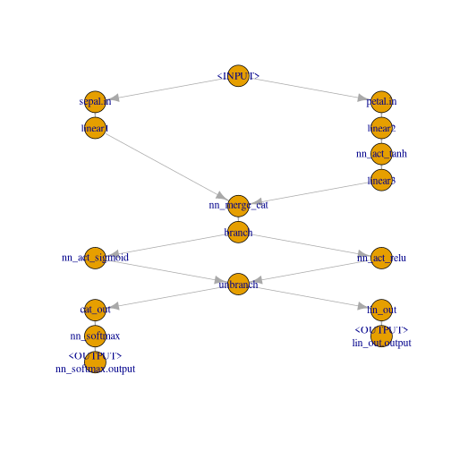
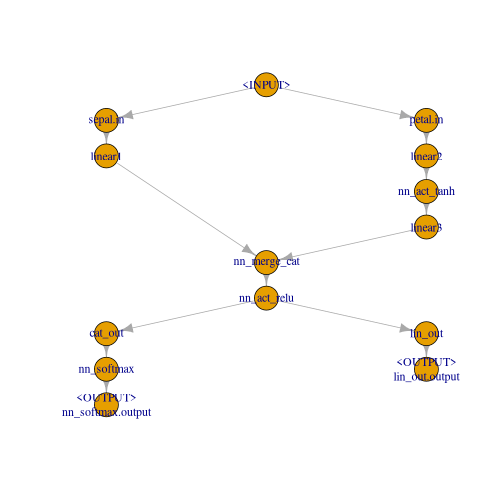
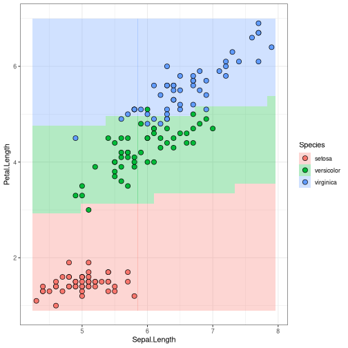
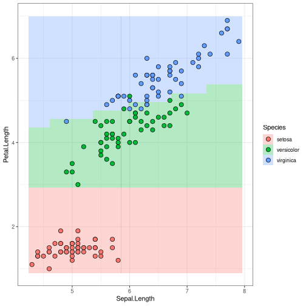
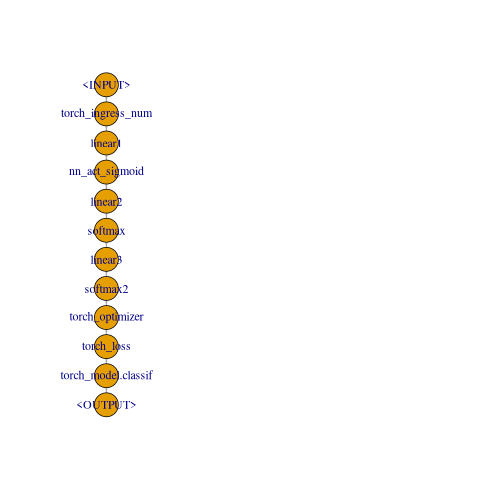
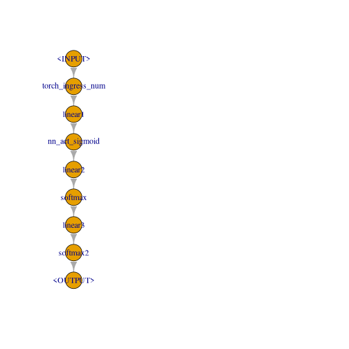
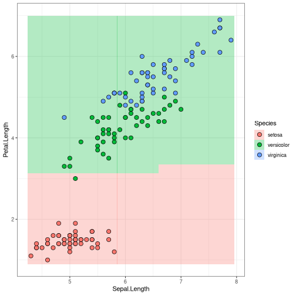
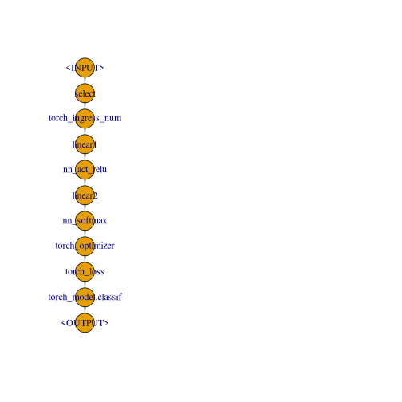
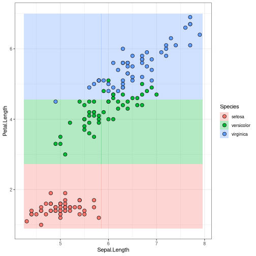
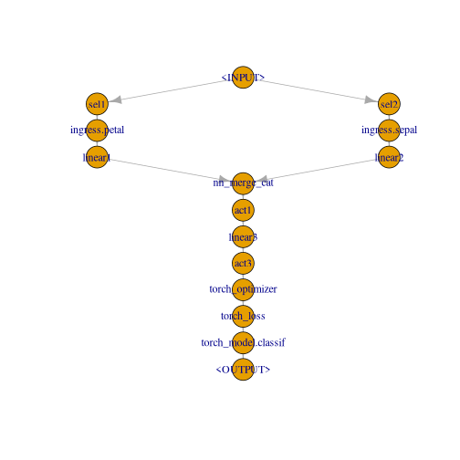

```r
library("torch")
library("mlr3torch")
```


# Intro

The TorchOps Neo project tries to use `mlr3pipelines` as a backet to implement building network architectures from `PipeOp`s. Specific `PipeOp`s, inheriting from [`PipeOpModule`], contain `torch_module` objects. These `PipeOp`s are chained in a `Graph` that passes `torch_tensor` objects along its edges. Another class of `PipeOp`, [`PipeOpTorch`], can be used to build these torch module `Graph`s, they become parts of normal data preprocessing pipelines. These two distinct classes of `PipeOp`s are necessary since they represent different things: The [`PipeOpTorch`] operators correspond to `torch`'s `nn_module_generator` functions, the [`PipeOpModule`] then contain the instantiated `nn_module`-objects.

Some further changes have been made compared to the old code, in particular the handling of different columns / datatypes within `Task`s and how network input is handled. The network training code was also refactored and simplified.

# Torch modules and `PipeOpModule`

## Torch Primer

Some input tensor: 2-batch of 3 units.

```r
input <- torch_randn(2, 3)
input
#> torch_tensor
#> -0.6151 -1.1218  0.8557
#> -0.7233 -0.4099  0.3029
#> [ CPUFloatType{2,3} ]
```

A `nn_module` is constructed from a `nn_module_generator`. `nn_linear` is one of the simpler generators:

```r
module_1 <- nn_linear(3, 4, bias = TRUE)
```

Applying this module gives a 2-batch of 4 units:


```r
output <- module_1(input)
output
#> torch_tensor
#> -0.1241 -0.0383  0.1454  0.0339
#> -0.0877 -0.0230  0.0280 -0.0510
#> [ CPUFloatType{2,4} ][ grad_fn = <AddmmBackward0> ]
```

A neural network with one (4-unit) hidden layer and two outputs needs the following ingredients


```r
activation <- nn_sigmoid()
module_2 <- nn_linear(4, 3, bias = TRUE)
softmax <- nn_softmax(2)
```

Piping a tensor through this:


```r
output <- module_1(input)
output <- activation(output)
output <- module_2(output)
output <- softmax(output)
output
#> torch_tensor
#>  0.5123  0.1009  0.3868
#>  0.5070  0.1030  0.3901
#> [ CPUFloatType{2,3} ][ grad_fn = <SoftmaxBackward0> ]
```

Training the neural network then consists of Toch keeping track of what parameters were used to calculate `output` to calculate gradients etc. In particular, this "piping through a series of modules" will happen a lot. An obvious idea here is to do this with `mlr3pipelines`.

## Wrapped Torch modules as `PipeOpModule`

Wrapping `nn_module` objects in a `PipeOp` has the advantage that the network structure can be represented as a `Graph` object where it is made explicit (can be plotted, can be extended or manipulated), compared to e.g. writing a function that pipes input through a series of modules.

A `PipeOpModule` can be used to wrap a module directly, but it is usually constructed by a `PipeOpTorch` (see later). It typically has a single input and a single output, although multiple inputs are possible (module is then called with multiple arguments), and multiple outputs are possible when the module-function returns a list. Number of outputs must be declared during construction, then.

Wrapping the linear `module_1` works like this:

```r
po_module_1 <- PipeOpModule$new("module_1", module_1)
```

It is used in the familiar way:

```r
output <- po_module_1$train(list(input))[[1]]
output
#> torch_tensor
#> -0.1241 -0.0383  0.1454  0.0339
#> -0.0877 -0.0230  0.0280 -0.0510
#> [ CPUFloatType{2,4} ][ grad_fn = <AddmmBackward0> ]
```

Note we only use the `$train()`, since Torch modules do not have anything that maps to the `state` (it is filled by an empty list).

The single hidden layer neural network can be constructed as a `Graph`, which can then do the training all at once.


```r
po_activation <- PipeOpModule$new("activation", activation)
po_module_2 <- PipeOpModule$new("module_2", module_2)
po_softmax <- PipeOpModule$new("softmax", softmax)

module_graph <- po_module_1 %>>% po_activation %>>% po_module_2 %>>% po_softmax
```

Using the `Graph`'s `$train()` to pipe a tensor through the `Graph`:

```r
output <- module_graph$train(input)[[1]]
output
#> torch_tensor
#>  0.5123  0.1009  0.3868
#>  0.5070  0.1030  0.3901
#> [ CPUFloatType{2,3} ][ grad_fn = <SoftmaxBackward0> ]
```

## `Graph` as a Torch module

The native class in `torch` that represents a transformation of tensors is the `nn_module`. It would therefore also be advantageous to have the `Graph` of `PipeOpModule` also be a `nn_module`. This is particularly useful because the `nn_module` does some accounting of the model parameters that it contains for backpropagation (I believe).

Instead of having a class that inherits both from `nn_module` and `Graph` (which doesn't work in R6, since multiple inheritance is not available), there is a class that inherits from `nn_module` and contains a `Graph` member slot (composition). This class is [`nn_graph`]. It is constructed with a `Graph`, as well as information about the shape(s) of the `torch_tensor`(s) it expects as inputs.

Shape info is communicated as an integer-valued `numeric` vector; dimensions that are arbitrary, e.g. batch-size, is given as `NA`.
Our network expects an input of shape `c(NA, 3)`, since the first layer was created as `nn_linear(in_features = 3)`. (Currently nothing is done with this shape information, but it could in the future be used for asserts, or maybe to concatenate `nn_graph`s.)

If the `Graph` has multiple outputs, it is also possible to select a subset of outputs to use, or change the output order, by giving the `output_map` argument.


```r
# the name of the single input is:
module_graph$input
#>               name        train predict    op.id channel.name
#> 1: module_1.input1 torch_tensor    NULL module_1       input1

graph_module <- nn_graph(
  module_graph,
  shapes_in = list(module_1.input1 = c(NA, 3))
)
```

This module gives us the convenience of torch `nn_module` objects, e.g.:


```r
graph_module$children
#> $modules
#> An `nn_module` containing 31 parameters.
#>
#> ── Modules ──────────────────────────────────────────────────────────────────────────────────────────────────────────────────────────────────────────────────────────────────────────────────────────────────────────────────────────────────────────────────────────────────────────────────────────────────────────────────
#> • 0: <nn_linear> #16 parameters
#> • 1: <nn_sigmoid> #0 parameters
#> • 2: <nn_linear> #15 parameters
#> • 3: <nn_softmax> #0 parameters
graph_module$parameters
#> $modules.0.weight
#> torch_tensor
#>  0.5764 -0.1063 -0.3156
#> -0.4759  0.1456  0.2529
#>  0.5319 -0.5228 -0.5649
#> -0.3713 -0.5328 -0.4598
#> [ CPUFloatType{4,3} ][ requires_grad = TRUE ]
#>
#> $modules.0.bias
#> torch_tensor
#>  0.3812
#> -0.3841
#>  0.3695
#> -0.3986
#> [ CPUFloatType{4} ][ requires_grad = TRUE ]
#>
#> $modules.2.weight
#> torch_tensor
#> -0.3044  0.2025  0.3502  0.2392
#> -0.1705 -0.4839 -0.3929 -0.2611
#>  0.4835  0.0918 -0.2528  0.4997
#> [ CPUFloatType{3,4} ][ requires_grad = TRUE ]
#>
#> $modules.2.bias
#> torch_tensor
#>  0.4211
#> -0.2770
#>  0.0158
#> [ CPUFloatType{3} ][ requires_grad = TRUE ]
```

And it can be used to transform tensors just as any other torch `nn_module`:


```r
graph_module(input)
#> torch_tensor
#>  0.5123  0.1009  0.3868
#>  0.5070  0.1030  0.3901
#> [ CPUFloatType{2,3} ][ grad_fn = <SoftmaxBackward0> ]
```

# Building Torch Models for Tasks using `PipeOpTorch`

## `ModelDescriptor`

The [`PipeOpModule`] represents anf `nn_module` that is fixed for a specific tensor shape and which has no hyperparameters. When constructing a neural network using these operators, one has to take care to have the output shape of operations match the input shapes of the following operations.

A complete `Graph` of matching [`PipeOpModule`]s can be constructed using operators that mostly inherit from [`PipeOpTorch`], making use of the [`ModelDescriptor`] class. The [`ModelDescriptor`] class contains a `Graph` of [`PipeOpModule`] and some more necessary meta-info. The [`PipeOpTorch`] transforms a [`ModelDescriptor`] and adds more [`PipeOpModule`]s to the `Graph`.

[`ModelDescriptor`]s always build up a [`Graph`] for a specific [`Task`]. The easiest way to initialize a proper [`ModelDescriptor`] is to use the appropriate [`PipeOpTorchIngress`] `PipeOp` for a given datatype.


```r
task <- tsk("iris")$select(colnames(iris)[1:3])

po_torch_in <- po("torch_ingress_num")
md <- po_torch_in$train(list(task))[[1]]

md
#> ModelDescriptor (1 ops):
#> [(NA,3)]
#> optimizer: N/A
#> loss: N/A
#> 0 callbacks
#> .pointer: torch_ingress_num.output [(NA,3)]
```

The [`ModelDescriptor`] is an S3 object that contains a [`Graph`], information about how to generate data (`$ingress` and `$task`), some further tags about how to build a model that are unrelated to architecture (`$optimizer`, `$loss` and `$callbacks`) as well as all further information necessary to extend that graph along a given output (`$.pointer` and `$.pointer_shape`).


```r
unclass(md)
#> $graph
#> Graph with 1 PipeOps:
#>                 ID         State sccssors prdcssors
#>  torch_ingress_num <<UNTRAINED>>
#>
#> $ingress
#> $ingress$torch_ingress_num.input
#> Ingress: Task[Petal.Length,Sepal.Length,Sepal.Width] --> Tensor(NA, 3)
#>
#>
#> $task
#> <TaskClassif:iris> (150 x 4): Iris Flowers
#> * Target: Species
#> * Properties: multiclass
#> * Features (3):
#>   - dbl (3): Petal.Length, Sepal.Length, Sepal.Width
#>
#> $optimizer
#> NULL
#>
#> $loss
#> NULL
#>
#> $callbacks
#> list()
#>
#> $.pointer
#> [1] "torch_ingress_num" "output"
#>
#> $.pointer_shape
#> [1] NA  3
```

The `$.pointer` identifies the output of the `$graph` that [`PipeOpTorch`] will extend. Piping this [`ModelDescriptor`] through [`PipeOpTorchLinear`], for example, adds a [`PipeOpModule`] wrapping a `torch` `nn_linear`.


```r
po_torch_linear <- po("nn_linear", out_features = 4)
md <- po_torch_linear$train(list(md))[[1]]

md$graph
#> Graph with 2 PipeOps:
#>                 ID         State  sccssors         prdcssors
#>  torch_ingress_num <<UNTRAINED>> nn_linear
#>          nn_linear <<UNTRAINED>>           torch_ingress_num
```

The `$.pointer` is now updated to identify the output of that [`PipeOpModule`], and the `$.pointer_shape` shows that the shape has changed to 4 units (was 3 for the input before).


```r
md$.pointer
#> [1] "nn_linear" "output"
md$.pointer_shape
#> [1] NA  4
```

The [`model_descriptor_to_module()`] function converts this to an [`nn_graph`], it is a functional `torch` `nn_module`.


```r
small_module <- model_descriptor_to_module(md, list(md$.pointer))

small_module(input)
#> torch_tensor
#> -0.3137 -0.8768  0.2784  0.8156
#> -0.2096 -0.2230  0.3014  0.3827
#> [ CPUFloatType{2,4} ][ grad_fn = <AddmmBackward0> ]
```

## Using [`ModelDescriptor`] to get Data

The [`ModelDescriptor`] does not only represent the `Graph` from which a `nn_module` is created, but also the way in which the `Task` is is processed to get input batches. A `torch` `dataset` can be created by calling `task_dataset()`; both the `task` and the `feature_ingress_tokens` arguments can be retrieved from the `ModelDescriptor`. The `target_batchgetter` needs to be created extra (if necessary), since it depends on the ultimate machine learning model, which we have not looked at so far.


```r
td <- task_dataset(
  task = md$task,
  feature_ingress_tokens = md$ingress
)

td
#> <dataset>
#>   Public:
#>     .getbatch: function (index)
#>     .getitem: function (index)
#>     .length: function ()
#>     all_features: Petal.Length Sepal.Length Sepal.Width Species
#>     clone: function (deep = FALSE)
#>     device: cpu
#>     feature_ingress_tokens: list
#>     initialize: function (task, feature_ingress_tokens, target_batchgetter = NULL,
#>     target_batchgetter: NULL
#>     task: TaskClassif, TaskSupervised, Task, R6
```

Use the `$.getbatch()` method to get a batch that can be given to the `nn_module`. Note it has an `$x` and an `$y` slot, the latter of which is not used, to account for possible target batches. The `$x` slot is also a `list`, since it should be able to handle NNs with multiple inputs (see below).

```r
batch <- td$.getbatch(1:3)
batch
#> $x
#> $x$torch_ingress_num.input
#> torch_tensor
#>  1.4000  5.1000  3.5000
#>  1.4000  4.9000  3.0000
#>  1.3000  4.7000  3.2000
#> [ CPUFloatType{3,3} ]
#>
#>
#> $y
#> NULL
#>
#> $.index
#> [1] 1 2 3

small_module(batch$x[[1]])
#> torch_tensor
#> -1.7056  0.6869  2.7267 -2.3736
#> -1.6314  0.8292  2.5745 -2.2808
#> -1.6109  0.6452  2.5483 -2.1707
#> [ CPUFloatType{3,4} ][ grad_fn = <AddmmBackward0> ]
```

## Building sequential NNs

The sequential NN from above can easily be implemented as follows:


```r
graph_generator <- po("torch_ingress_num") %>>%
  po("nn_linear", out_features = 4, id = "linear1") %>>%
    po("nn_act_sigmoid") %>>%
    po("nn_linear", out_features = 3, id = "linear2") %>>%
	po("nn_softmax", dim = 2)
```

Note how the second `nn_linear` does not need to be informed about the output dimension of the first `nn_linear`, since the [`ModelDescriptor`] that is passed along the `Graph` edges knows this info (in the `$.pointer_shape` slot).


```r
md_sequential <- graph_generator$train(task)[[1]]

graph_module <- model_descriptor_to_module(md_sequential, list(md_sequential$.pointer))

graph_module(input)
#> torch_tensor
#>  0.2369  0.2273  0.5359
#>  0.2500  0.2194  0.5306
#> [ CPUFloatType{2,3} ][ grad_fn = <SoftmaxBackward0> ]
```


## Building more interesting NNs

The selling-point of `mlr3pipelines` is its ability to easily represent computational `Graph`s. The [`ModelDescriptor`] / [`PipeOpTorch`] setup is built to make full use of this functionality. It is possible to have multiple inputs into a NN by using multiple [`PipeOpTorchIngress`] inputs, it is possible to have parallel and alternative path branching, and it is possible to have multiple outputs.

Consider the following (a bit nonsensical) network that operates differently on the `"Petal"` than on the `"Sepal"` features of `tsk("iris")`. We manually split the task here, further down it is shown that the wholly integrated `mlr3pipelines` pipeline can do this automatically.


```r
iris_petal <- tsk("iris")$select(c("Petal.Length", "Petal.Width"))
iris_sepal <- tsk("iris")$select(c("Sepal.Length", "Sepal.Width"))
```


```r
graph_sepal <- po("torch_ingress_num", id = "sepal.in") %>>%
  po("nn_linear", out_features = 4, id = "linear1")

graph_petal <- po("torch_ingress_num", id = "petal.in") %>>%
  po("nn_linear", out_features = 3, id = "linear2") %>>%
  po("nn_act_tanh") %>>%
  po("nn_linear", out_features = 5, id = "linear3")

graph_common <- ppl("branch", graphs = list(
    sigmoid = po("nn_act_sigmoid"),
    relu = po("nn_act_relu")
  )) %>>%
  gunion(list(
    po("nn_linear", out_features = 1, id = "lin_out"),
    po("nn_linear", out_features = 3, id = "cat_out") %>>%
      po("nn_softmax", dim = 2)
  ))


graph_iris <- gunion(list(graph_sepal, graph_petal)) %>>%
  po("nn_merge_cat") %>>%
  graph_common

graph_iris$plot()
```



We can use this to create a neural network for the `iris` tasks we created above. We set the `$keep_results` debug flag here so we can do some inspection about what is happening:


```r
graph_iris$param_set$values$branch.selection <- "relu"

graph_iris$keep_results = TRUE

iris_mds <- graph_iris$train(
  input = list(sepal.in.input = iris_sepal, petal.in.input = iris_petal),
  single_input = FALSE
)

iris_mds
#> $lin_out.output
#> ModelDescriptor (11 ops):
#> [(NA,2);(NA,2)]
#> optimizer: N/A
#> loss: N/A
#> 0 callbacks
#> .pointer: lin_out.output [(NA,1)]
#>
#> $nn_softmax.output
#> ModelDescriptor (11 ops):
#> [(NA,2);(NA,2)]
#> optimizer: N/A
#> loss: N/A
#> 0 callbacks
#> .pointer: nn_softmax.output [(NA,3)]
```

We make multiple observations here:

1. We can observe how the [`ModelDescriptor`] grows as it is passed along the edges of `graph_iris`. Note that the `$graph` slot of that [`ModelDescriptor`] is often updated by-reference, so by the time we inspect intermediate results, they may contain the complete graph. However, see how the `$ingress`, `$.pointer` and `$.pointer_shape` of the [`ModelDescriptor`]s that take the `sepal.in`-path differ from the ones that take the `petal.in`-path:


    ```r
    # sepal.in path
    graph_iris$pipeops$linear1$.result[[1]]$ingress
    #> $sepal.in.input
    #> Ingress: Task[Sepal.Length,Sepal.Width] --> Tensor(NA, 2)
    graph_iris$pipeops$linear1$.result[[1]]$.pointer
    #> [1] "linear1" "output"
    graph_iris$pipeops$linear1$.result[[1]]$.pointer_shape
    #> [1] NA  4

    # petal.in path
    graph_iris$pipeops$linear3$.result[[1]]$ingress
    #> $petal.in.input
    #> Ingress: Task[Petal.Length,Petal.Width] --> Tensor(NA, 2)
    graph_iris$pipeops$linear3$.result[[1]]$.pointer
    #> [1] "linear3" "output"
    graph_iris$pipeops$linear3$.result[[1]]$.pointer_shape
    #> [1] NA  5
    ```

    `po("nn_merge_cat")` unites the two [`ModelDescriptor`]s and contains the common ingress. The `.pointer_shape` now reflects the output of the "cat"-operation: the 2nd dimension is added up:


    ```r
    graph_iris$pipeops$nn_merge_cat$.result[[1]]$ingress
    #> $sepal.in.input
    #> Ingress: Task[Sepal.Length,Sepal.Width] --> Tensor(NA, 2)
    #>
    #> $petal.in.input
    #> Ingress: Task[Petal.Length,Petal.Width] --> Tensor(NA, 2)
    graph_iris$pipeops$nn_merge_cat$.result[[1]]$.pointer_shape
    #> [1] NA  9
    ```
1. Multiple [`ModelDescriptor`]s were created, since the `graph_iris` has multiple outpus. This makes it possible to create a neural network with multiple outputs. We need to unite the outputs of `graph_iris` using [`model_descriptor_union()`] before we can pass it to [`model_descriptor_to_module()`]. We need to collect all `output_pointers` separately.

    `list_output` must be set to `TRUE` since the module has multiple outputs.


    ```r
    iris_mds_union = model_descriptor_union(iris_mds[[1]], iris_mds[[2]])
    output_pointers = list(iris_mds[[1]]$.pointer, iris_mds[[2]]$.pointer)
    output_pointers
    #> [[1]]
    #> [1] "lin_out" "output"
    #>
    #> [[2]]
    #> [1] "nn_softmax" "output"
    iris_module = model_descriptor_to_module(iris_mds_union, output_pointers, list_output = TRUE)
    ```
1. The `PipeOpBranch` disappears in the resulting `Graph` of [`PipeOpModule`] in the `iris_module`. This is because only the [`PipeOpTorch`]s in the `graph_iris` add anything to the [`ModelDescriptor`]s. The branch is interpeted when `graph_iris` runs, and only the `nn_act_relu` path is followed. The `iris_module` therefore contains a `Graph` that does "relu" activation:


    ```r
    iris_module$graph$plot()
    ```

    
1. The [`ModelDescriptor`]'s `$task` slot contains a `Task` with all features that are used to create the input data for all NN inputs. It can be given to `task_dataset()`, along with the `$ingress`, to create a `torch` `dataset` that creates all batches. As above, any output of `graph_iris` can be used:


    ```r
    iris_mds_union$task  # contains all features
    #> <TaskClassif:iris> (150 x 5): Iris Flowers
    #> * Target: Species
    #> * Properties: multiclass
    #> * Features (4):
    #>   - dbl (4): Petal.Length, Petal.Width, Sepal.Length, Sepal.Width

    iris_td <- task_dataset(
      task = iris_mds_union$task,
      feature_ingress_tokens = iris_mds_union$ingress
    )

    batch <- iris_td$.getbatch(1:2)
    batch
    #> $x
    #> $x$sepal.in.input
    #> torch_tensor
    #>  5.1000  3.5000
    #>  4.9000  3.0000
    #> [ CPUFloatType{2,2} ]
    #>
    #> $x$petal.in.input
    #> torch_tensor
    #>  1.4000  0.2000
    #>  1.4000  0.2000
    #> [ CPUFloatType{2,2} ]
    #>
    #>
    #> $y
    #> NULL
    #>
    #> $.index
    #> [1] 1 2
    ```
1. The resulting module has multiple inputs and multiple outputs. We call it with the first two rows of iris, but set the debug `$keep_results` flag so we can inspect what is happening in the `nn_module`'s `$graph`:


    ```r
    iris_module$graph$keep_results = TRUE

    iris_module(
      sepal.in.input = batch$x$sepal.in.input,
      petal.in.input = batch$x$petal.in.input
    )
    #> $lin_out.output
    #> torch_tensor
    #> -0.9763
    #> -0.9231
    #> [ CPUFloatType{2,1} ][ grad_fn = <AddmmBackward0> ]
    #>
    #> $nn_softmax.output
    #> torch_tensor
    #>  0.6215  0.2313  0.1472
    #>  0.6223  0.2271  0.1507
    #> [ CPUFloatType{2,3} ][ grad_fn = <SoftmaxBackward0> ]
    ```
    The first linear layer that takes "Sepal" input (`"linear1"`) creates a 2x4 tensor (batch size 2, 4 units), while the `"linear3"` layer has 2x5 output:


    ```r
    iris_module$graph$pipeops$linear1$.result
    #> $output
    #> torch_tensor
    #> -0.8638  3.5871  0.4092  1.9318
    #> -0.8888  3.3598  0.4124  1.9700
    #> [ CPUFloatType{2,4} ][ grad_fn = <AddmmBackward0> ]
    iris_module$graph$pipeops$linear3$.result
    #> $output
    #> torch_tensor
    #> -0.7321 -0.1352 -0.5793 -0.1470 -0.3101
    #> -0.7321 -0.1352 -0.5793 -0.1470 -0.3101
    #> [ CPUFloatType{2,5} ][ grad_fn = <AddmmBackward0> ]
    ```
    We observe that the `po("nn_merge_cat")` concatenates these, as expected:


    ```r
    iris_module$graph$pipeops$nn_merge_cat$.result
    #> $output
    #> torch_tensor
    #> -0.8638  3.5871  0.4092  1.9318 -0.7321 -0.1352 -0.5793 -0.1470 -0.3101
    #> -0.8888  3.3598  0.4124  1.9700 -0.7321 -0.1352 -0.5793 -0.1470 -0.3101
    #> [ CPUFloatType{2,9} ][ grad_fn = <CatBackward0> ]
    ```

# Building Torch Learners

## Optimizer and Loss

We have now seen how NN `Graph`s of [`PipeOpModule`] are created and turned into `nn_module`s. Using [`PipeOpTorch`] even creates [`ModelDescriptor`] objects that contain additional info about how batch tensors are extracted from `Task`s. For a complete `Learner`, it is still necessary to define the loss-function used for optimization, and the optimizer itself.

Optimizers are represented as [`TorchOptimizer`] objects -- they wrap a `torch` `torch_optimizer_generator` object but also provide a `ParamSet`. They can be obtained from a `Dictionary` using the `t_opt` quick-access function.


```r
adam <- t_opt("adam", lr = 0.02)
adam
#> <TorchOptimizer>
#>   Public:
#>     clone: function (deep = FALSE)
#>     get_optimizer: function (params)
#>     initialize: function (torch_optimizer, param_set = NULL, label = deparse(substitute(torch_optimizer))[[1]])
#>     label: adam
#>     optimizer: function (params, lr = 0.001, betas = c(0.9, 0.999), eps = 1e-08,
#>     param_set: ParamSet, R6
adam$param_set
#> <ParamSet>
#>              id    class lower upper nlevels     default value
#> 1:           lr ParamDbl 0e+00   Inf     Inf       0.001  0.02
#> 2:        betas ParamUty    NA    NA     Inf 0.900,0.999
#> 3:          eps ParamDbl 1e-16 1e-04     Inf       1e-08
#> 4: weight_decay ParamDbl 0e+00 1e+00     Inf           0
#> 5:      amsgrad ParamLgl    NA    NA       2       FALSE
```

Loss-functions work the same: [`TorchLoss`] are obtained from a `Dictionary` using `t_loss()` and they have `ParamSet`s.


```r
xe <- t_loss("cross_entropy")
xe
#> <TorchLoss>
#>   Public:
#>     clone: function (deep = FALSE)
#>     get_loss: function ()
#>     initialize: function (torch_loss, tasktypes = NULL, param_set = NULL, label = deparse(substitute(torch_loss))[[1]])
#>     label: cross_entropy
#>     loss: function (weight = NULL, ignore_index = -100, reduction = "mean")
#>     param_set: ParamSet, R6
#>     tasktypes: classif
```

## [`LearnerClassifTorchModel`] and [`LearnerRegrTorchModel`]

[`LearnerClassifTorchModel`] represents a classification model using `torch` NNs. It needs a `nn_module`, as well as a list of [`TorchIngressToken`] that define how batches are created from a `Task`. [`TorchIngressToken`] hard-code the column-names of a `Task` that are used for data-input, the `Learner` created like this therefore only works for the specific `Task` created. (Generally the full `mlr3pipelines`-UI should be used if this is a problem, see below.) The following uses the sequential NN from above:


```r
lr_sequential <- LearnerClassifTorchModel$new(
  network = model_descriptor_to_module(md_sequential, list(md_sequential$.pointer)),
  ingress_tokens = md_sequential$ingress,
  optimizer = adam,
  loss = xe
)

lr_sequential
#> <LearnerClassifTorchModel:classif.torch>: Torch Classification Network
#> * Model: -
#> * Parameters: list()
#> * Packages: mlr3, mlr3torch, torch
#> * Predict Type: response
#> * Feature types: logical, integer, numeric, character, factor, ordered,
#>   POSIXct, imageuri
#> * Properties: hotstart_forward, multiclass, twoclass, weights
```

Before training the model, we set some more hyperparameters. Among others, we use a [`CallbackTorch`] that prints progress and validation losses that we request.


```r
lr_sequential$param_set$values$batch_size = 50
lr_sequential$param_set$values$epochs = 50
lr_sequential$param_set$values$callbacks = list(CallbackTorchProgress)
lr_sequential$param_set$values$measures_train = msrs(c("classif.logloss", "classif.ce"))
lr_sequential$predict_type = "response"

lr_sequential$train(md_sequential$task)
#> Epoch 1
#> Training [===================================================================]
#>
#> [Summary epoch 1]
#> ------------------
#> Measures (Train):
#>  * classif.logloss = 1.16
#>  * classif.ce = 0.67
#> Epoch 2
#> Training [============================================>----------------------]
#> Training [===================================================================]
#>
#> [Summary epoch 2]
#> ------------------
#> Measures (Train):
#>  * classif.logloss = 1.09
#>  * classif.ce = 0.67
#> Epoch 3
#>
#> [Summary epoch 3]
#> ------------------
#> Measures (Train):
#>  * classif.logloss = 1.04
#>  * classif.ce = 0.49
#> Epoch 4
#>
#> [Summary epoch 4]
#> ------------------
#> Measures (Train):
#>  * classif.logloss = 0.99
#>  * classif.ce = 0.33
#> Epoch 5
#>
#> [Summary epoch 5]
#> ------------------
#> Measures (Train):
#>  * classif.logloss = 0.96
#>  * classif.ce = 0.33
#> Epoch 6
#>
#> [Summary epoch 6]
#> ------------------
#> Measures (Train):
#>  * classif.logloss = 0.92
#>  * classif.ce = 0.33
#> Epoch 7
#>
#> [Summary epoch 7]
#> ------------------
#> Measures (Train):
#>  * classif.logloss = 0.89
#>  * classif.ce = 0.33
#> Epoch 8
#>
#> [Summary epoch 8]
#> ------------------
#> Measures (Train):
#>  * classif.logloss = 0.85
#>  * classif.ce = 0.33
#> Epoch 9
#>
#> [Summary epoch 9]
#> ------------------
#> Measures (Train):
#>  * classif.logloss = 0.82
#>  * classif.ce = 0.33
#> Epoch 10
#>
#> [Summary epoch 10]
#> ------------------
#> Measures (Train):
#>  * classif.logloss = 0.79
#>  * classif.ce = 0.33
#> Epoch 11
#>
#> [Summary epoch 11]
#> ------------------
#> Measures (Train):
#>  * classif.logloss = 0.76
#>  * classif.ce = 0.33
#> Epoch 12
#>
#> [Summary epoch 12]
#> ------------------
#> Measures (Train):
#>  * classif.logloss = 0.73
#>  * classif.ce = 0.33
#> Epoch 13
#>
#> [Summary epoch 13]
#> ------------------
#> Measures (Train):
#>  * classif.logloss = 0.71
#>  * classif.ce = 0.33
#> Epoch 14
#>
#> [Summary epoch 14]
#> ------------------
#> Measures (Train):
#>  * classif.logloss = 0.68
#>  * classif.ce = 0.33
#> Epoch 15
#>
#> [Summary epoch 15]
#> ------------------
#> Measures (Train):
#>  * classif.logloss = 0.66
#>  * classif.ce = 0.33
#> Epoch 16
#>
#> [Summary epoch 16]
#> ------------------
#> Measures (Train):
#>  * classif.logloss = 0.64
#>  * classif.ce = 0.33
#> Epoch 17
#>
#> [Summary epoch 17]
#> ------------------
#> Measures (Train):
#>  * classif.logloss = 0.62
#>  * classif.ce = 0.33
#> Epoch 18
#>
#> [Summary epoch 18]
#> ------------------
#> Measures (Train):
#>  * classif.logloss = 0.59
#>  * classif.ce = 0.33
#> Epoch 19
#>
#> [Summary epoch 19]
#> ------------------
#> Measures (Train):
#>  * classif.logloss = 0.57
#>  * classif.ce = 0.33
#> Epoch 20
#>
#> [Summary epoch 20]
#> ------------------
#> Measures (Train):
#>  * classif.logloss = 0.55
#>  * classif.ce = 0.33
#> Epoch 21
#>
#> [Summary epoch 21]
#> ------------------
#> Measures (Train):
#>  * classif.logloss = 0.53
#>  * classif.ce = 0.33
#> Epoch 22
#>
#> [Summary epoch 22]
#> ------------------
#> Measures (Train):
#>  * classif.logloss = 0.50
#>  * classif.ce = 0.32
#> Epoch 23
#>
#> [Summary epoch 23]
#> ------------------
#> Measures (Train):
#>  * classif.logloss = 0.49
#>  * classif.ce = 0.31
#> Epoch 24
#>
#> [Summary epoch 24]
#> ------------------
#> Measures (Train):
#>  * classif.logloss = 0.47
#>  * classif.ce = 0.23
#> Epoch 25
#>
#> [Summary epoch 25]
#> ------------------
#> Measures (Train):
#>  * classif.logloss = 0.46
#>  * classif.ce = 0.13
#> Epoch 26
#>
#> [Summary epoch 26]
#> ------------------
#> Measures (Train):
#>  * classif.logloss = 0.45
#>  * classif.ce = 0.13
#> Epoch 27
#>
#> [Summary epoch 27]
#> ------------------
#> Measures (Train):
#>  * classif.logloss = 0.44
#>  * classif.ce = 0.11
#> Epoch 28
#>
#> [Summary epoch 28]
#> ------------------
#> Measures (Train):
#>  * classif.logloss = 0.43
#>  * classif.ce = 0.08
#> Epoch 29
#>
#> [Summary epoch 29]
#> ------------------
#> Measures (Train):
#>  * classif.logloss = 0.42
#>  * classif.ce = 0.07
#> Epoch 30
#>
#> [Summary epoch 30]
#> ------------------
#> Measures (Train):
#>  * classif.logloss = 0.41
#>  * classif.ce = 0.10
#> Epoch 31
#>
#> [Summary epoch 31]
#> ------------------
#> Measures (Train):
#>  * classif.logloss = 0.41
#>  * classif.ce = 0.11
#> Epoch 32
#>
#> [Summary epoch 32]
#> ------------------
#> Measures (Train):
#>  * classif.logloss = 0.39
#>  * classif.ce = 0.06
#> Epoch 33
#>
#> [Summary epoch 33]
#> ------------------
#> Measures (Train):
#>  * classif.logloss = 0.38
#>  * classif.ce = 0.07
#> Epoch 34
#>
#> [Summary epoch 34]
#> ------------------
#> Measures (Train):
#>  * classif.logloss = 0.37
#>  * classif.ce = 0.06
#> Epoch 35
#>
#> [Summary epoch 35]
#> ------------------
#> Measures (Train):
#>  * classif.logloss = 0.37
#>  * classif.ce = 0.09
#> Epoch 36
#>
#> [Summary epoch 36]
#> ------------------
#> Measures (Train):
#>  * classif.logloss = 0.36
#>  * classif.ce = 0.07
#> Epoch 37
#>
#> [Summary epoch 37]
#> ------------------
#> Measures (Train):
#>  * classif.logloss = 0.35
#>  * classif.ce = 0.07
#> Epoch 38
#>
#> [Summary epoch 38]
#> ------------------
#> Measures (Train):
#>  * classif.logloss = 0.34
#>  * classif.ce = 0.06
#> Epoch 39
#>
#> [Summary epoch 39]
#> ------------------
#> Measures (Train):
#>  * classif.logloss = 0.33
#>  * classif.ce = 0.05
#> Epoch 40
#>
#> [Summary epoch 40]
#> ------------------
#> Measures (Train):
#>  * classif.logloss = 0.32
#>  * classif.ce = 0.07
#> Epoch 41
#>
#> [Summary epoch 41]
#> ------------------
#> Measures (Train):
#>  * classif.logloss = 0.31
#>  * classif.ce = 0.05
#> Epoch 42
#>
#> [Summary epoch 42]
#> ------------------
#> Measures (Train):
#>  * classif.logloss = 0.31
#>  * classif.ce = 0.05
#> Epoch 43
#> Training [============================================>----------------------]
#> Training [===================================================================]
#>
#> [Summary epoch 43]
#> ------------------
#> Measures (Train):
#>  * classif.logloss = 0.30
#>  * classif.ce = 0.06
#> Epoch 44
#> Training [===================================================================]
#>
#> [Summary epoch 44]
#> ------------------
#> Measures (Train):
#>  * classif.logloss = 0.29
#>  * classif.ce = 0.05
#> Epoch 45
#>
#> [Summary epoch 45]
#> ------------------
#> Measures (Train):
#>  * classif.logloss = 0.28
#>  * classif.ce = 0.06
#> Epoch 46
#>
#> [Summary epoch 46]
#> ------------------
#> Measures (Train):
#>  * classif.logloss = 0.28
#>  * classif.ce = 0.07
#> Epoch 47
#>
#> [Summary epoch 47]
#> ------------------
#> Measures (Train):
#>  * classif.logloss = 0.27
#>  * classif.ce = 0.04
#> Epoch 48
#>
#> [Summary epoch 48]
#> ------------------
#> Measures (Train):
#>  * classif.logloss = 0.27
#>  * classif.ce = 0.06
#> Epoch 49
#>
#> [Summary epoch 49]
#> ------------------
#> Measures (Train):
#>  * classif.logloss = 0.27
#>  * classif.ce = 0.07
#> Epoch 50
#>
#> [Summary epoch 50]
#> ------------------
#> Measures (Train):
#>  * classif.logloss = 0.26
#>  * classif.ce = 0.05
```

The following calls the `$predict_newdata` function to plot the response surface along the `Sepal.Width = mean(Sepal.Width)` plane, along with the ground-truth values:


```r
library("data.table")
newdata <- cbind(data.table(Sepal.Width = mean(iris$Sepal.Width)), CJ(
  Sepal.Length = seq(min(iris$Sepal.Length), max(iris$Sepal.Length), length.out = 30),
  Petal.Length = seq(min(iris$Petal.Length), max(iris$Petal.Length), length.out = 30)
))

predictions <- lr_sequential$predict_newdata(newdata)

library("ggplot2")

plot_predictions <- function(predictions) {
  ggplot(cbind(newdata, Species = predictions$response),
      aes(x = Sepal.Length, y = Petal.Length, fill = Species)) +
    geom_tile(alpha = .3) +
    geom_point(data = iris,
      aes(x = Sepal.Length, y = Petal.Length, fill = Species),
      color = "black", pch = 21, size = 3) +
    theme_bw()
}
plot_predictions(predictions)
```



# Torch Learner Pipelines

The model shown above is constructed using the [`ModelDescriptor`] that is generated from a `Graph` of [`PipeOpTorch`] operators.
The [`ModelDescriptor`] furthermore contains the `Task` to which it pertains. This makes it possible to use it to create a NN model that gets trained right away, using [`PipeOpTorchModelClassif`]. The only missing prerequisite now is to add the desired [`TorchOptimizer`] and [`TorchLoss`] information to the [`ModelDescriptor`].

## Adding Optimizer and Loss Meta-Info to [`ModelDescriptor`]

Remember that [`ModelDescriptor`] has the `$optimizer` and `$loss` slots that are necessary to build a complete `Learner` from an NN. They can be set by corresponding [`PipeOpTorch`] operators.

`po("torch_optimizer")` is used to set the `$optimizer` slot of a [`ModelDescriptor`]; it takes the desired `TorchOptimizer` object on construction and exports its `ParamSet`.

```r
po_adam = po("torch_optimizer", optimizer = adam)

# hyperparameters are made available and can be changed:
po_adam$param_set$values
#> $lr
#> [1] 0.02

md_sequential <- po_adam$train(list(md_sequential))[[1]]

md_sequential$optimizer
#> <TorchOptimizer>
#>   Public:
#>     clone: function (deep = FALSE)
#>     get_optimizer: function (params)
#>     initialize: function (torch_optimizer, param_set = NULL, label = deparse(substitute(torch_optimizer))[[1]])
#>     label: adam
#>     optimizer: function (params, lr = 0.001, betas = c(0.9, 0.999), eps = 1e-08,
#>     param_set: ParamSet, R6
```


```r
po_xe <- po("torch_loss", loss = xe)
md_sequential <- po_xe$train(list(md_sequential))[[1]]

md_sequential$loss
#> <TorchLoss>
#>   Public:
#>     clone: function (deep = FALSE)
#>     get_loss: function ()
#>     initialize: function (torch_loss, tasktypes = NULL, param_set = NULL, label = deparse(substitute(torch_loss))[[1]])
#>     label: cross_entropy
#>     loss: function (weight = NULL, ignore_index = -100, reduction = "mean")
#>     param_set: ParamSet, R6
#>     tasktypes: classif
```

## Combined Instantiation and Training of [`LearnerClassifTorchModel`]

The [`ModelDescriptor`] can now be given to a `po("torch_model.classif")`.

```r
po_model = po("torch_model.classif", batch_size = 50, epochs = 50)

po_model$train(list(md_sequential))
#> $output
#> NULL
```

`po("torch_model.classif")` behaves similarly to a `PipeOpLearner`: It returns `NULL` during training, and the prediction on `$predict()`.


```r
newtask = TaskClassif$new("newdata", cbind(newdata, Species = factor(NA, levels = levels(iris$Species))), target = "Species")

predictions <- po_model$predict(list(newtask))[[1]]

plot_predictions(predictions)
```



## The whole Pipeline

Remember that `md_sequential` was created using a `Graph` that the initial `Task` was piped through. If we combine such a `Graph` with [`PipeOpTorchModelClassif`], we get a `Graph` that behaves like any other `Graph` that ends with a `PipeOpLearner`, and can therefore be wrapped as a `GraphLearner`. The following uses one more hidden layer than before:


```r
graph_sequential_full <- po("torch_ingress_num") %>>%
  po("nn_linear", out_features = 4, id = "linear1") %>>%
    po("nn_act_sigmoid") %>>%
    po("nn_linear", out_features = 3, id = "linear2") %>>%
	po("nn_softmax", dim = 2, id = "softmax") %>>%
    po("nn_linear", out_features = 3, id = "linear3") %>>%
	po("nn_softmax", dim = 2, id = "softmax2") %>>%
    po("torch_optimizer", optimizer = adam) %>>%
    po("torch_loss", loss = xe) %>>%
    po("torch_model.classif", batch_size = 50, epochs = 100)
lr_sequential_full = as_learner(graph_sequential_full)

lr_sequential_full$train(task)
```

Compare the resulting `Graph`

```r
graph_sequential_full$plot()
```



With the `Graph` of the trained model:

```r
model <- lr_sequential_full$graph_model$state$torch_model.classif$model
model$network$graph$plot()
```



Predictions, as before (we can use `predict_newdata` again):

```r
predictions <- lr_sequential_full$predict_newdata(newdata)

plot_predictions(predictions)
```



## Mixed Pipelines

We are not just limited to [`PipeOpTorch`] in these kinds of `Graph`s, and we are also not limited to having only a single [`PipeOpTorchIngress`]. The following pipeline, for example, removes all but the `Petal.Length` columns from the `Task` and fits a model:


```r
gr <- po("select", selector = selector_name("Petal.Length")) %>>%
    po("torch_ingress_num") %>>%
    po("nn_linear", out_features = 5, id = "linear1") %>>%
    po("nn_act_relu") %>>%
    po("nn_linear", out_features = 3, id = "linear2") %>>%
	po("nn_softmax", dim = 2) %>>%
    po("torch_optimizer", optimizer = adam) %>>%
    po("torch_loss", loss = xe) %>>%
    po("torch_model.classif", batch_size = 50, epochs = 50)
gr$plot()
```



```r
lr <- as_learner(gr)
lr$train(task)
predictions <- lr$predict_newdata(newdata)

plot_predictions(predictions)
```



How about using `Petal.Length` and `Sepal.Length` separately at first?


```r
gr <- gunion(list(
      po("select", selector = selector_name("Petal.Length"), id = "sel1") %>>%
        po("torch_ingress_num", id = "ingress.petal") %>>%
        po("nn_linear", out_features = 3, id = "linear1"),
      po("select", selector = selector_name("Sepal.Length"), id = "sel2") %>>%
        po("torch_ingress_num", id = "ingress.sepal") %>>%
        po("nn_linear", out_features = 3, id = "linear2")
    )) %>>%
    po("nn_merge_cat")  %>>%
    po("nn_act_relu", id = "act1")%>>%
    po("nn_linear", out_features = 3, id = "linear3") %>>%
	po("nn_softmax", dim = 2, id = "act3") %>>%
    po("torch_optimizer", optimizer = adam, lr = 0.1) %>>%
    po("torch_loss", loss = xe) %>>%
    po("torch_model.classif", batch_size = 50, epochs = 50)
gr$plot()
```



```r
lr <- as_learner(gr)
lr$train(task)
predictions <- lr$predict_newdata(newdata)

plot_predictions(predictions)
```


